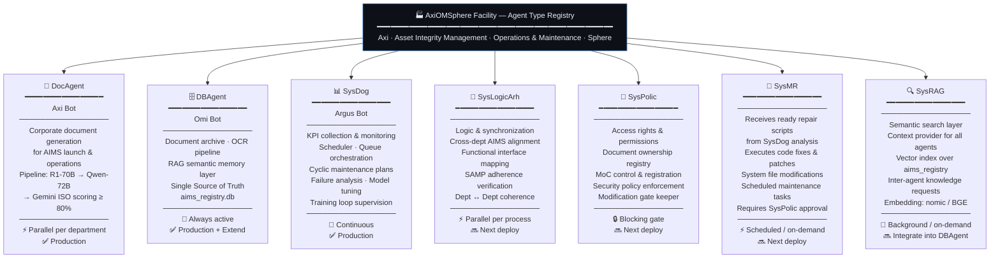
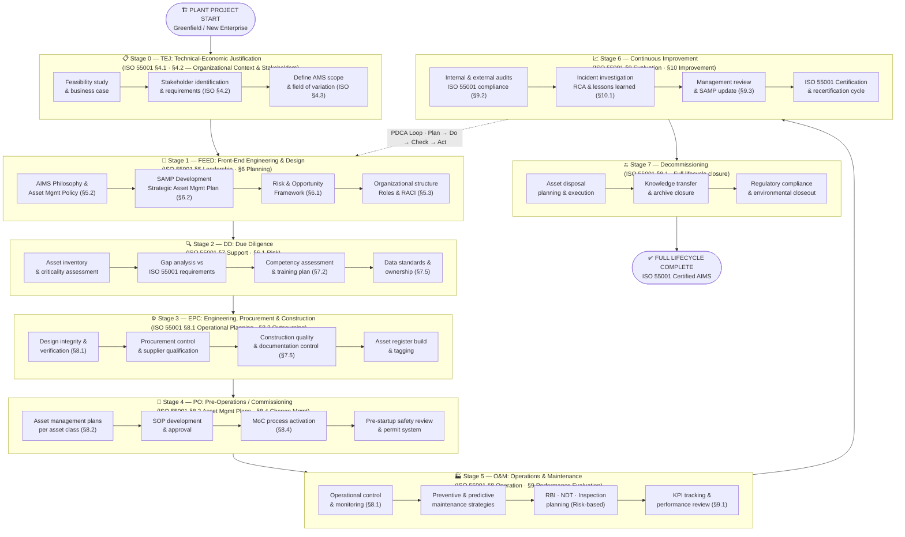
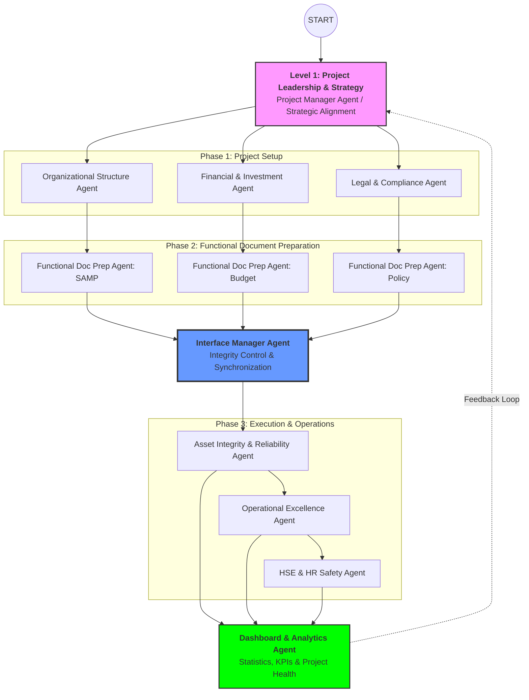
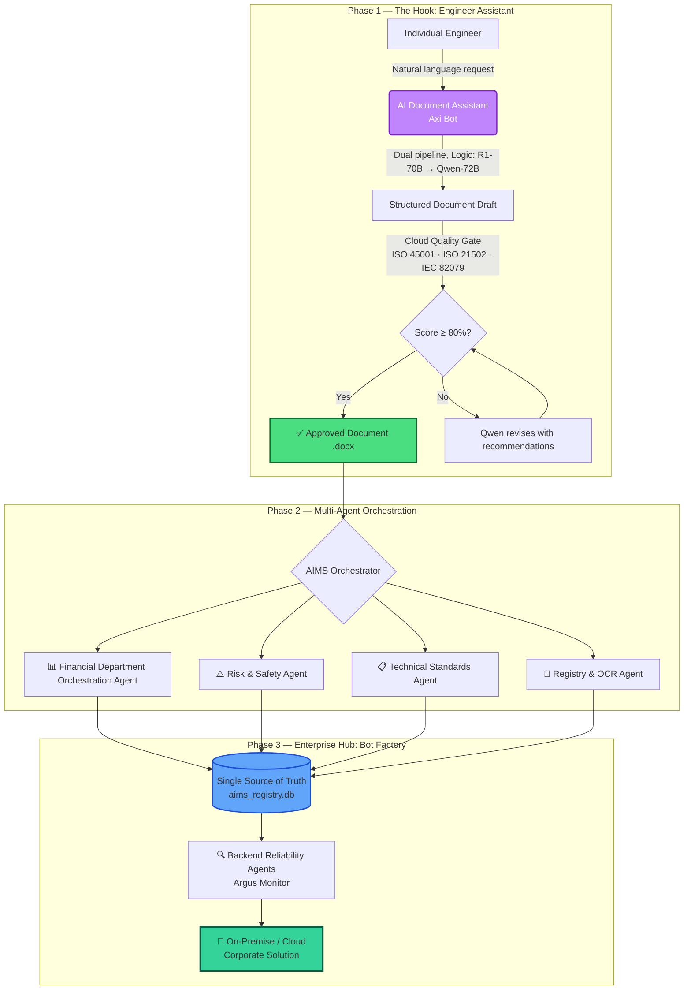
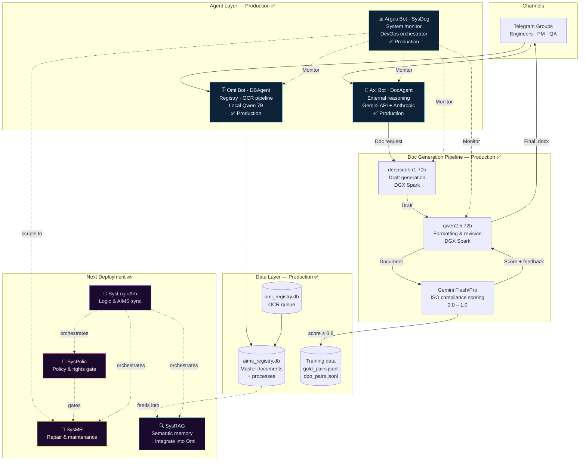
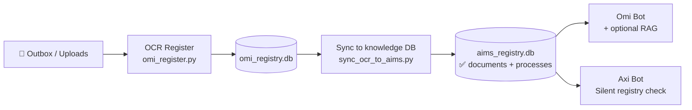
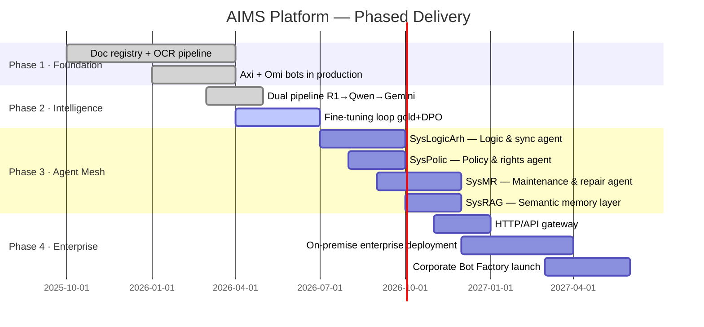

# AxiOMSphere Facility
> **Multi-Agent Platform for Integrated Asset Integrity & O&M Lifecycle Orchestration**

## 🧩 Project Nomenclature
The name **AxiOMSphere** is a strategic integration of our core technological pillars:

* **Axiom**: Representing the foundational, self-evident precision of international standards.
* **AIMS**: **A**sset **I**ntegrity **M**anagement **S**ystem — the central intelligence core.
* **O&M**: **O**peration & **M**aintenance — focusing on the high-value phase of the industrial lifecycle.
* **Sphere**: A unified, 360-degree multi-agent ecosystem ensuring a "Single Source of Truth".

---

[🌐 Website](https://axiomsphereaassistanceaims.github.io/AIMS-Agent-Orchestrator/) · [📺 Demo Video](#demo) · [📬 Contact](#contact) · [📋 Apply for Credits](#grant-applications)

---

## One-liner

An **industrial multi-agent platform** for the launch of production projects, based on the Asset Integrity Management System (AIMS) approach (ISO 55001, ISO 55002), enables optimization of resources and timelines for pilot project deployment. The platform is designed for extension across all project lifecycle stages — from FEED through decommissioning — with further scalability to support full-cycle AIMS implementation.

---

## The Problem

At the project justification stage, there is a critical need for empirical data, guiding documentation, and foundational decisions that will shape the project's development. These early choices can ultimately determine either the failure or the economic success of the enterprise.

In practice, organizations often proceed with launching low-budget pilot versions of projects. However, limited resources frequently result in poor-quality documentation and suboptimal outcomes. While project execution methodologies have long been established, success largely depends on how consistently and accurately teams follow clear procedural steps to build an integrated project management system.

Despite the existence of fully standardized processes, there is still no interactive system capable of supporting key specialists in real time — providing intelligent guidance and acting as a companion that can efficiently navigate extensive, widely published yet fragmented standardization sources.

**Artificial intelligence can address this gap** by serving as a network of specialized, fine-tuned agents, each designed for a specific purpose and trained on organization-specific documentation stored on corporate servers or within secure enterprise on-line platforms.

---

## Our Solution: From Hook to Factory
**Project Overview: AI-Agent Structural Integration**

**The Core Concept and Know-How**
The key innovation of this project lies in its unique organizational structure and the precisely defined functional tasks assigned to individual AI agents. Each agent specializes in high-precision, niche solutions within its specific domain. Effectively, these agents execute the routine duties typically performed by human engineers, but with a guaranteed, predictable outcome. This enables their integration into a unified, task-oriented workflow that complies with the **ISO 55001** standard, ensuring that all agents operate within a synchronized system and a single structural unit, striving toward a common objective.

**Uniqueness and Practical Foundation**
The uniqueness of this solution is rooted in its application of real-world data from successful, existing projects. It has been developed based on the practical expertise of specialists who have a proven track record of launching complex projects.

**Standardization and Certification**
The framework is built upon the well-established ISO 55001 asset management standard and adheres to the **ISO 55002** guidelines. This strict alignment with international standards provides a clear roadmap for formal system certification, ensuring operational reliability and global compatibility.

**Operational Logic of the Standard**
The implementation of the standard follows this sequence:

**Defining the Scope:** The process begins by establishing the "field of variation" (the operational scope).

**Strategic Alignment:** Define the Asset Management System (AIMS) philosophy, articulate project goals with stakeholders, and delineate investment areas.

**Functional Distribution:** Functional descriptions are assigned to departmental agents, and departmental provision documents are generated to codify these roles.

**System Integration:** Functionality is linked via an Interface Manager Agent. Specialized "Engineer Agents" are assigned to each department to generate supporting documentation for every function.

**Dynamic Management:** The entire ecosystem is supported by an Interface/Manager Agent whose primary task is to orchestrate functional interactions. Any modification of these interactions automatically updates the documentation for all subordinate functions.

---

## 🏗 Factory Architecture & Development Roadmap
The project evolves through a hierarchical deployment of specialized agents, ensuring that operational execution always follows strategic integrity.

---

### Diagram 1 — AxiOMSphere Agent Type Registry

> 7 universal agent types deployed across all departments of any Plant Project.
> Each type runs in parallel instances within different functional domains simultaneously.



---

### Diagram 2 — Plant Project Development Sequence
#### From General to Specific · ISO 55001:2024 / ISO 55002:2018

> Sequence verified against ISO 55001 clause structure:
> §4 Context → §5 Leadership → §6 Planning → §7 Support → §8 Operation → §9 Evaluation → §10 Improvement



---

### Diagram 3 — Agent Deployment Matrix: AxiOMSphere × Plant Project Lifecycle

> Which agent types are active at each stage. Agents combine and run in parallel within each stage.
> SysLogicArh acts as Interface Manager — active across all stages simultaneously.

```mermaid
flowchart LR
    subgraph LEGEND["Legend"]
        L1["🟢 Active / Core"]
        L2["🟡 Partial / Advisory"]
        L3["⚫ Not applicable"]
    end

    subgraph TEJ["Stage 0 · TEJ"]
        TEJ1["📄 DocAgent\nFeasibility docs\nBusiness case 🟢"]
        TEJ2["🗄️ DBAgent\nRegistry init\nDoc archive 🟢"]
        TEJ3["📊 SysDog\nBaseline KPI\ndefinition 🟡"]
        TEJ4["🧠 SysLogicArh\nScope mapping\nStakeholder logic 🟢"]
        TEJ5["🔐 SysPolic\nInitial rights\n& ownership 🟢"]
        TEJ6["🔧 SysMR\n— ⚫"]
        TEJ7["🔍 SysRAG\nISO knowledge\nbase index 🟢"]
    end

    subgraph FEED["Stage 1 · FEED"]
        FEED1["📄 DocAgent\nSAMP · Policy\nObjectives docs 🟢"]
        FEED2["🗄️ DBAgent\nSAMP storage\nVersion control 🟢"]
        FEED3["📊 SysDog\nKPI framework\nReporting setup 🟢"]
        FEED4["🧠 SysLogicArh\nDept alignment\nFunctional sync 🟢"]
        FEED5["🔐 SysPolic\nMoC framework\nApproval matrix 🟢"]
        FEED6["🔧 SysMR\n— ⚫"]
        FEED7["🔍 SysRAG\nContext for\nSAMP drafting 🟢"]
    end

    subgraph DD["Stage 2 · DD"]
        DD1["📄 DocAgent\nGap analysis\nCompetency reports 🟢"]
        DD2["🗄️ DBAgent\nAsset data import\nOCR legacy docs 🟢"]
        DD3["📊 SysDog\nGap scoring\nMaturity metrics 🟢"]
        DD4["🧠 SysLogicArh\nProcess mapping\nISO clause match 🟢"]
        DD5["🔐 SysPolic\nData ownership\nAccess rights 🟢"]
        DD6["🔧 SysMR\n— ⚫"]
        DD7["🔍 SysRAG\nLegacy doc\nsemantic search 🟢"]
    end

    subgraph EPC["Stage 3 · EPC"]
        EPC1["📄 DocAgent\nTech specs\nQA docs · ITPs 🟢"]
        EPC2["🗄️ DBAgent\nAsset register\nTagging & OCR 🟢"]
        EPC3["📊 SysDog\nMilestone tracking\nQuality metrics 🟢"]
        EPC4["🧠 SysLogicArh\nDesign ↔ Ops\nalignment 🟡"]
        EPC5["🔐 SysPolic\nDocument control\nChange approval 🟢"]
        EPC6["🔧 SysMR\nPunch list\nscripts 🟡"]
        EPC7["🔍 SysRAG\nSpec retrieval\nfor engineers 🟢"]
    end

    subgraph PO["Stage 4 · Pre-Ops"]
        PO1["📄 DocAgent\nSOPs · Permits\nSafety procs 🟢"]
        PO2["🗄️ DBAgent\nAs-built docs\nFinal registry 🟢"]
        PO3["📊 SysDog\nCommissioning\nqueues 🟢"]
        PO4["🧠 SysLogicArh\nOps ↔ Maint\ninterface 🟢"]
        PO5["🔐 SysPolic\nMoC activation\nPermit-to-work 🟢"]
        PO6["🔧 SysMR\nSystem config\nsetup scripts 🟢"]
        PO7["🔍 SysRAG\nProcedure lookup\nfor operators 🟢"]
    end

    subgraph OM["Stage 5 · O&M"]
        OM1["📄 DocAgent\nMaint plans\nIncident reports 🟢"]
        OM2["🗄️ DBAgent\nWork orders\nLog archiving 🟢"]
        OM3["📊 SysDog\nKPI dashboards\nFailure analysis\nModel fine-tuning 🟢"]
        OM4["🧠 SysLogicArh\nCross-dept sync\nContinuous AIMS 🟢"]
        OM5["🔐 SysPolic\nOngoing MoC\nAccess mgmt 🟢"]
        OM6["🔧 SysMR\nPreventive tasks\nRepair scripts\nScheduled patches 🟢"]
        OM7["🔍 SysRAG\nMaint knowledge\nbase 🟢"]
    end

    subgraph DECOM["Stage 6 · Decommission"]
        DECOM1["📄 DocAgent\nDisposal docs\nFinal reports 🟢"]
        DECOM2["🗄️ DBAgent\nArchive closure\nKnowledge transfer 🟢"]
        DECOM3["📊 SysDog\nFinal metrics\nLessons learned 🟢"]
        DECOM4["🧠 SysLogicArh\nHandover logic\nDept wind-down 🟡"]
        DECOM5["🔐 SysPolic\nFinal rights\ntransfer 🟢"]
        DECOM6["🔧 SysMR\nShutdown\nscripts 🟢"]
        DECOM7["🔍 SysRAG\nHistorical\nknowledge export 🟡"]
    end

    TEJ --> FEED --> DD --> EPC --> PO --> OM --> DECOM

    subgraph ORCH["⚙️ Orchestrator Layer — Active Across ALL Stages"]
        ORC["🧠 SysLogicArh acts as Interface Manager\n━━━━━━━━━━━━━━━━━━━━━━━━━━━━━━━━━━━━━━━━━━━━━━━\nRoutes tasks · Syncs agents · Auto-updates docs on any change\nValidates readiness gates between stages"]
    end

    ORCH -.->|"always active"| TEJ & FEED & DD & EPC & PO & OM & DECOM
```



---

## Project Escalation



---

## Document Generation Agent Structure



---

## 🟢 Live System Architecture
> What is built and running **today** with real engineers



---

## Doc Generation Pipeline

The core AI loop — **R1 → Qwen → Gemini** — runs today on DGX Spark hardware:

| Stage | Model | Role | Avg. Time |
|-------|-------|------|-----------|
| **Draft** | deepseek-r1:70b | Structural reasoning, ISO-aware outline | ~5 min |
| **Format** | qwen2.5:72b | Professional formatting, section rewrite | ~3 min |
| **Score** | Gemini Flash/Pro | ISO compliance 0.0–1.0, gap feedback | ~15 sec |
| **Revise** | qwen2.5:72b | Targeted revision using Gemini feedback | ~2 min |

Output: production `.docx` with ≥80% ISO compliance score. If score < 0.6, pipeline retries automatically.

**Training loop baked in:** every run produces `gold_pairs.jsonl` (score ≥ 0.8) and `standard_dpo_pairs.jsonl` for continuous model fine-tuning.

---

## Standards We Align With

| Standard | Scope |
|----------|-------|
| **ISO 55001:2024** | Asset management — Management systems — Requirements |
| **ISO 55002:2018** | Asset management — Guidelines for the application of ISO 55001 |
| **ISO 21502:2020** | Project management guidance |
| **ISO 21500:2021** | Project, programme and portfolio management concepts |
| **IEC/IEEE 82079-1:2019** | Preparation of information for use — technical documentation |
| **ISO 9001 §7.5** | Control of documented information |
| **ISO 45001** | Occupational health and safety management |
| **API RP 505** | Fire protection for refineries |

---

## ISO 55001 Clause Mapping to Plant Project Stages

| ISO 55001 Clause | Requirement | Plant Project Stage |
|------------------|-------------|---------------------|
| §4.1–4.3 | Context, stakeholders, scope | TEJ |
| §5.1–5.3 | Leadership, policy, roles | FEED |
| §6.1–6.2 | Risk framework, SAMP, objectives | FEED → DD |
| §7.1–7.5 | Resources, competence, documentation | DD → EPC |
| §8.1–8.4 | Operations, asset plans, MoC | EPC → PO → O&M |
| §9.1–9.3 | Monitoring, audit, management review | O&M |
| §10.1–10.3 | Improvement, corrective action | O&M → continuous |

---

## Document & OCR Pipeline



---

## Minimal Code Example

```python
from doc_agent import DocAgent, DocGenerationRequest

agent = DocAgent()

result_path, preview, score, feedback = agent.generate(
    DocGenerationRequest(
        user_request="Create a Job Safety Analysis for confined space entry at an underground mine. "
                     "Reference ISO 45001. Include hazard table, controls hierarchy, permit conditions.",
        dual_pipeline=True,   # R1-70B → Qwen-72B → Gemini quality gate
    )
)

print(f"Document: {result_path}")
print(f"ISO compliance score: {score:.0%}")
print(f"Feedback: {feedback}")
# → Document: /data/JSA_confined_space_entry.docx
# → ISO compliance score: 84%
# → Feedback: Document covers all required JSA sections with complete hazard controls matrix.
```

---

## Use Cases

| Use Case | Document Type | Standard |
|----------|---------------|----------|
| Confined space entry | Job Safety Analysis (JSA) | ISO 45001 |
| H2S release at gas plant | Emergency Response Procedure | API RP 505 |
| Fan replacement in mine | Management of Change (MOC) | ISO 45001 §8.1.3 |
| Project kick-off | Project charter + WBS | ISO 21502 |
| Technical manual | User documentation | IEC 82079-1 |

---

## Roadmap



---

## Repository Layout

```
AIMS-Agent-Orchestrator/
├── README.md                    ← this file
├── LICENSE                      (Apache-2.0)
├── docs/
│   ├── ARCHITECTURE.md          system design details
│   ├── DEMO_SCENARIO.md         step-by-step demo guide
│   ├── STANDARDS_MAPPING.md     ISO/IEC clause → agent capability
│   └── EMAILS_STARTUP_CREDITS.md
├── examples/
│   └── doc_agent_example.py     minimal usage example
└── docker-compose.yml           evaluation setup (optional)
```

---

## Grant Applications

We are seeking cloud credits / startup program support from:

| Program | Status | What we need |
|---------|--------|--------------|
| [Google for Startups Cloud Program](https://cloud.google.com/startup) | Applying | GPU compute for inference |
| [Microsoft Founders Hub](https://foundershub.startups.microsoft.com/) | Applying | Azure credits |
| [OpenAI Startup Program](https://openai.com/startups) | Applying | API credits |
| [NVIDIA Inception](https://www.nvidia.com/en-us/startups/) | Applying | DGX access / support |

---

## Demo

**Coming soon:** 60-second screen recording — engineer types a natural-language request → DocAgent dual pipeline → ISO-compliant `.docx` delivered to Telegram in under 10 minutes.

[📺 Watch Demo](#) · [🖼 Architecture Diagram](docs/ARCHITECTURE.md) · [🌐 Landing Page](https://axiomsphereaassistanceaims.github.io/AIMS-Agent-Orchestrator/)

---

## Contact

**Evgeny Shokk** — Founder, AIMS Platform

- 📧 Evgeny.shock@gmail.com
- 🌐 [Website](https://axiomsphereaassistanceaims.github.io/AIMS-Agent-Orchestrator/)
- 💼 [LinkedIn](https://www.linkedin.com/in/evgeny-shokk-54781716)

---

## License

[Apache License 2.0](LICENSE)

> Built on open-source: Python · Ollama · deepseek-r1 · Qwen2.5 · Google Gemini · python-telegram-bot · python-docx
