# AxiOMSphere
> **Multi-agent AI platform that automates industrial engineering workflows — from document generation to ISO compliance — using coordinated LLM agents running on private infrastructure.**

[🌐 Website](https://axiomsphereaassistanceaims.github.io/AIMS-Agent-Orchestrator/) · [📺 Demo](#demo) · [📬 Contact](#contact) · [📋 Apply for Credits](#grant-applications)

---

## What We Do

AxiOMSphere replaces manual project startup engineering work with coordinated AI agents. Each agent handles one function — document generation, quality control, registry management, infrastructure monitoring — and they operate as a continuous pipeline.

**The result is 1,5 year for 1 month:**
-  A document describing a business process, typically written in 2-3 days each by several specialists from different disciplines (recruited for a specific project), can be created in less than 10 minutes within an integrated functional system within a single functional area, in accordance with the AIMS project philosophy (a total of 1.5 years of work in 1 month). Even by non-experts or department heads, it allows for task assignments via chat, voice, or text, from any location. The database is based on several projects, providing valuable experience.
- ISO compliance verified automatically, not by hand
- Every generation run feeds back into model training — the system improves with every use

We're currently working in production with live engineers and actively scaling usage. We expect significant demand for the API in the next 1-3 months as the team expands and new types of documentation, tests, and cross-validations are added.

---

## Business Impact

| Before AxiOMSphere | With AxiOMSphere |
|-------------------|-----------------|
| 2–3 days to write a Oeration & Maintenance procedure | 5–10 minutes, reviewed and delivered to Telegram |
| 20 engineers / 2 DCC specialists / 5 department heads / 2 HR specialists to write 1000 procedures for 1.5 years | 5 engineers (hybrid work), 5-10 minutes, problem formulation 10 minutes, 1000 documents will be checked and sent to Telegram and saved in the database with full compliance with the company format and banding within 14 days |
| Any change in functionality in the vertical distribution chain will require a process of revising the upstream documents of 1000 procedures for 1.5 years | An integrated system capable of independently reviewing and comparing functionality and interface interactions is capable of restoring discrepancies in documents in a matter of hours, even without the process of revising them |
| ISO compliance checked manually, often skipped | Automated scoring 0.0–1.0, rewrite loop until ≥80% |
| Knowledge locked in PDFs on shared drives | Searchable, versioned, semantically indexed master documents registry |
| Model training requires a separate team | Every production run generates gold + DPO training pairs automatically |
| Infra issues noticed when users complain | Argus monitors 24/7, auto-restarts, alerts with one-click fix (every one has unic function) |

---

## Why We Need API Credits

AxiOMSphere is a **high-frequency, multi-agent system** where every user task decomposes into coordinated agent stages:

```
User request → Planning → Draft (R1-70B) → Rewrite (Qwen-72B) → Score (Gemini) → Revise → Register → Notify
```

Unlike a single-prompt application, **one document workflow requires 20–100+ LLM calls**:
- Complince agent: standart's identification by context (allocation for ISO55001/55002)
- Reasoning agent: structural outline + ISO clause mapping to standard ISO 9000:2015:
- Rewrite agent: professional formatting pass ISO 19005-1:2005
- Quality gate: compliance scoring + gap feedback
- Revision loop: targeted rewrites until score ≥ 80%
- Registry agent: classification, embedding, storage

**Expected usage as we scale:**
- Workflows run continuously (CI/CD-style, nightly pipeline)
- Multiple agents operate in parallel per task
- Every scaling step compounds token consumption

**What credits enable:**
1. Validate multi-agent orchestration at production scale
2. Optimize prompt strategies across model configurations
3. Benchmark admin 14B / coding 32/ logical 70B / fine formating 72B quality vs. the highest documents tuned cloud model tradeoffs
4. Create production-ready automated pipelines for broader enterprise document processing and localization in professional collection databases. 

Without sufficient API capacity it is not possible to realistically simulate or validate real-world agent workloads at the volume our architecture is designed for.

> We are not building a chatbot. We are building a system designed for sustained, large-scale LLM usage where API consumption is a core component of the product.

---

## Demo

**Scenario: Automated Safety Document Generation**

```
Input:  "developing a preservation procedure for an Aluminum plant, as requested. The procedure was being structured as a
        Word document (.docx) with initial sections covering Purpose, Scope, and Definitions, and was designed to incorporate
        the specified subcomponents: Power Plant, Power Distribution (HV/LV), Paste Plant, Anode Baking Plant, Bath Crushing
        Plants, Pot Lines, Fume Treatment Plant, Cast House, Port Facilities, and Utilities.
         Reference ISO 55001. The AIMS process database synchronization."

Stage 1 — Planning agent      (~30 sec)
  → Identifies: JSA template, applicable OSHA 29 CFR 1910.147 local corporate manuals and procedures based on equipment types
  → Outlines: scope, equipment types identification sections, control hierarchy

Stage 2 — Draft agent: deepseek-r1:70b   (~5 min)
  → Generates structured draft with ISO 10013 / ISO/IEC Directives -aware section headers
  → Produces hazard table with risk matrix, elimination → substitution → PPE controls

Stage 3 — Rewrite agent: qwen2.5:72b     (~3 min)
  → Professional formatting, paragraph cohesion, terminology standardization ISO 2145:1978

Stage 4 — Compliance gate: Gemini Flash  (~15 sec)
  → Score: 0.84 / 1.0
  → Feedback: "Add specific corrections and specification per ....."

Stage 5 — Revision: qwen2.5:72b          (~2 min)
  → Target correction applied, assessment re-checked (knowledge base and lessons learned in background)

Output: JSA_confined_space_entry.docx → delivered to Telegram
        ISO compliance: 84%   |   Total time: ~11 min
        Training pair saved → gold_pairs.jsonl (score ≥ 0.8)
```

[📺 Video demo coming soon] · [🖼 Architecture](docs/ARCHITECTURE.md)

---

## Use Cases in Production Today

| Task | Document type | Standard | Time |
|------|--------------|----------|------|
| AIMS philosophies | Asset Management systems - Guidelines | ISO 55001/55002 | ~10 min |
| Procedures Equipment types, unites scope, standart requirement | Equipment isolation procedure + requirement matrix | OSHA 29 CFR 1910.147 local corporate manuals and procedures | ~12 min |
| Pump replacement — change control | Management of Change (MOC) | ISO 45001 §8.1.3 | ~8 min |
| New asset onboarding | Asset Management Plan | ISO 55001 §8.2 | ~15 min |
| Project kick-off package | Charter + WBS | ISO 21502 | ~20 min |
| Technical operating manual | User documentation | IEC 82079-1 | ~18 min |

---

## Minimal Code Example

```python
from doc_agent import DocAgent, DocGenerationRequest

agent = DocAgent()

result_path, preview, score, feedback = agent.generate(
    DocGenerationRequest(
        user_request="Create a Job Safety Analysis for confined space entry at an underground mine. "
                     "Reference ISO 45001. Include hazard table, controls hierarchy, permit conditions.",
        dual_pipeline=True,   # R1-70B → Qwen-72B → Gemini quality gate
    )
)

print(f"Document: {result_path}")
print(f"ISO compliance score: {score:.0%}")
print(f"Feedback: {feedback}")
# → Document: /data/JSA_confined_space_entry.docx
# → ISO compliance score: 84%
# → Feedback: "Document covers all required JSA sections with complete hazard controls matrix."
```

---

## 🟢 Live System — What Runs Today

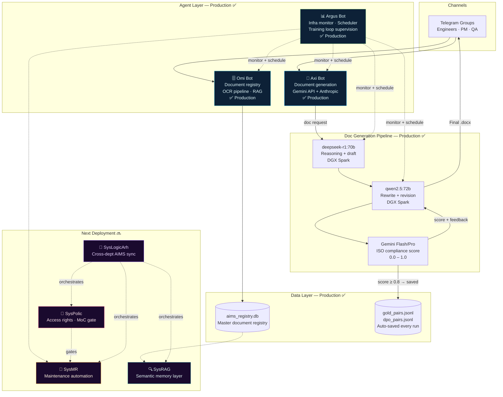

---

## How It Works

### Doc Generation Pipeline

| Stage | Model | Role | Time |
|-------|-------|------|------|
| **Draft** | deepseek-r1:70b | ISO-aware reasoning, structural outline | ~5 min |
| **Rewrite** | qwen2.5:72b | Professional formatting, terminology | ~3 min |
| **Score** | Gemini Flash/Pro | Compliance 0.0–1.0, gap feedback | ~15 sec |
| **Revise** | qwen2.5:72b | Targeted fix per Gemini feedback | ~2 min |

Quality gate: <60% → reject + retry · ≥60% → accepted · target **98% compliance**

### NLP Intent Routing

All 3 bots use a local fine-tuned model (`chat_intent_router.py`) to classify free-text messages into slash commands **before** any cloud LLM call — keeping latency low and cloud costs minimal:

```
"check if DGX is up"  →  /dgx status
"show stuck tasks"    →  /tasks --stuck
"generate MOC doc"    →  /doc --type=moc
```

### Continuous Training Loop

Every production run auto-saves training pairs — no opt-in flag needed:
- `gold_pairs.jsonl` — document + task pairs scoring ≥ 0.8
- `dpo_pairs.jsonl` — preference pairs for RLHF

These feed the nightly fine-tuning pipeline (14B → 70B → 72B), so the system improves as it operates.

---

## Agent Architecture — 7 Types

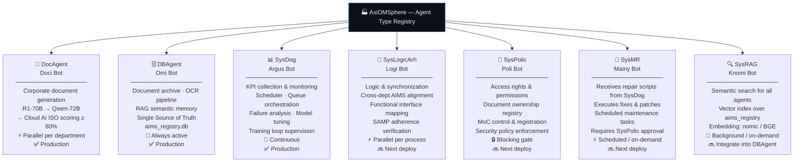

---

## Project Nomenclature

**AxiOMSphere** is a strategic integration of four pillars:

| Part | Meaning |
|------|---------|
| **Axiom** | Foundational precision of international standards |
| **AIMS** | Asset Integrity Management System — central intelligence |
| **O&M** | Operations & Maintenance — highest-value lifecycle phase |
| **Sphere** | Unified 360° ecosystem — Single Source of Truth |

---

## AIMS Process Framework

The agent factory is structured around the **GFMAM Asset Management Landscape** — 8 subject areas forming the complete ISO 55001-aligned process framework.

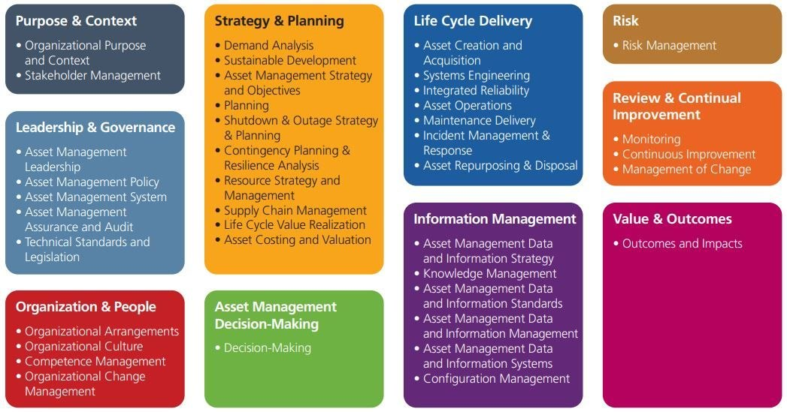

> *Global Forum on Maintenance and Asset Management (GFMAM) — aligned with ISO 55001:2024*

---

## ISO-Aligned Project Lifecycle

AxiOMSphere covers all 7 stages of an industrial plant project:

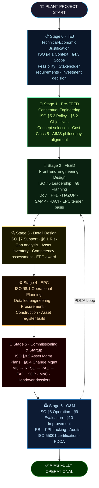

---

## Deployment Roadmap

### Agent Build, Test & Tuning Sequence

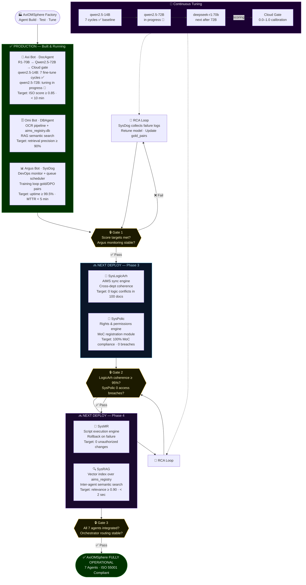

### Master Timeline

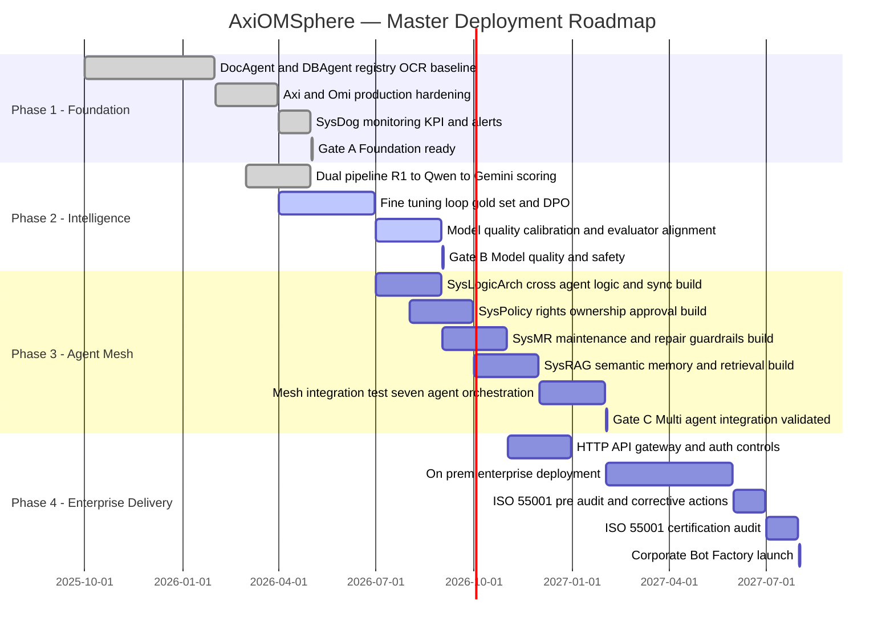

### Gate KPI Criteria

- **Gate A — Foundation ready:** OCR/sync ≥ 98% for 30 days · P95 retrieval ≤ 5s · SysDog alerting active
- **Gate B — Model quality:** Retrieval relevance ≥ 0.85 · Format compliance ≥ 95% · Hallucination ≤ 3% on critical docs
- **Gate C — Multi-agent integration:** 7-agent pass rate ≥ 95% · Zero SysPolicy violations · Cross-agent handoff P95 ≤ 15s
- **Gate D — Enterprise launch:** UAT signed · MTTR ≤ 30 min in pilot · Audit nonconformities closed

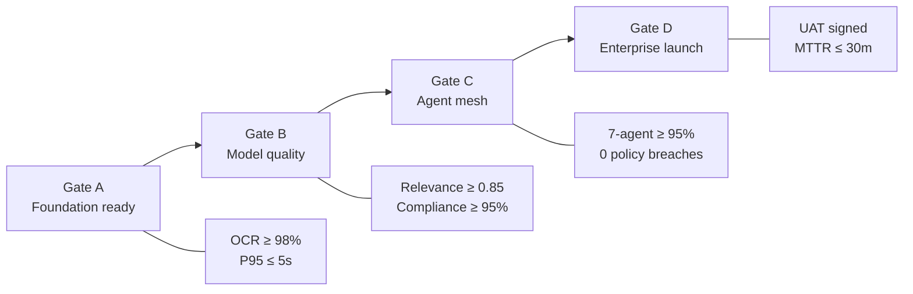

---

## Industrial Project Escalation

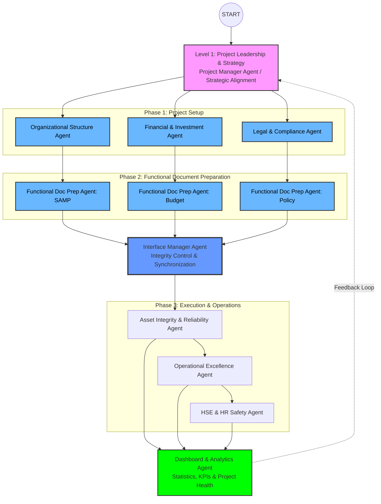

---

## Document Generation — Agent Structure

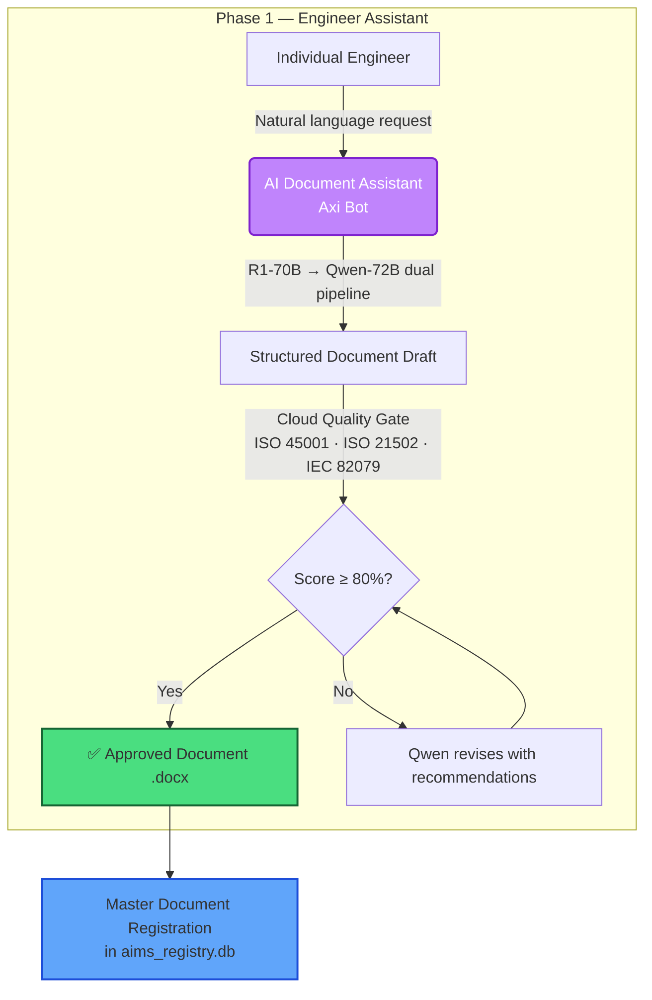

---

## Document & OCR Pipeline

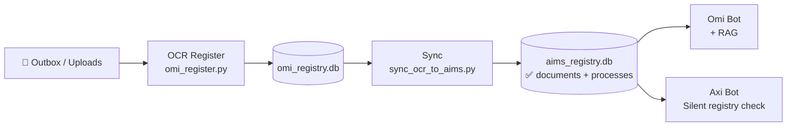

---

## Data Pipeline (Full)

```mermaid
flowchart TD
    A["👤 User sends file via Telegram"] --> B["inbox/income/"]
    B --> C["OCR Watcher (GPU)"]
    C --> D["outbox/ (text extracted)"]
    D --> E{"Quality Gate\nsimilarity ≥ 90%?"}
    E -->|"✅ pass"| F["aims_registry.db\n+ Qdrant embedding"]
    E -->|"❌ fail"| G["inbox/Skipped/"]
    F --> H["RAG Search"]
    H --> I["DocAgent — Qwen 72B DGX"]
    I --> J["generated/*.docx → Telegram"]
    style F fill:#1a4731
    style G fill:#4a1515
    style I fill:#1a2f4a
```

---

## Fine-Tuning Pipeline


**Model versioning:** `vN` / `vNrM` — e.g. `v7`, `v7r1`, `v8`, `v8r2`

---

## GPU Cluster Topology

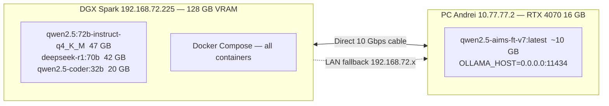

**Routing rules:** Small models (14B FT) → PC Andrei only · Two 70B+ models never loaded simultaneously · `OLLAMA_RESOLVE_TTL_SEC=30` prevents 6s latency when DGX unreachable

---

## Technical Reference

### Model Table

| Model | Size | Node | Role |
|-------|------|------|------|
| `qwen2.5-aims-ft-v7:latest` | ~10 GB | PC Andrei | Routing / NLP classify (current FT) |
| `qwen2.5:72b-instruct-q4_K_M` | 47 GB | DGX (cold) | DocAgent rewrite, training pair gen |
| `deepseek-r1:70b` | 42 GB | DGX (cold) | DocAgent reasoning / draft |
| `qwen2.5-coder:32b` | 20 GB | DGX (warm) | Argus diagnostics / code |

### Services & Ports

| Service | Port | Notes |
|---------|------|-------|
| DocAgent API | **8767** | FastAPI, used by Omi + Axi |
| Qdrant | **6333** | Vector DB — RAG |
| LiteLLM Proxy | 4400 | Gemini ×4 keys + Anthropic fallback |
| Grafana | 3000 | DGX monitoring dashboard |
| Task Registry | 8765 | FastAPI CRUD, monitored by Argus |

### Night Schedule

| Time | Task | Note |
|------|------|------|
| 22:30 | VRAM unload | Pre-DocBench cleanup |
| 23:00 | DocBench nightly | Quality test |
| 00:01 | training_ingest | New documents |
| 00:30 | training_generate_pairs | 72B, ~60–90 min |
| **02:30** | ft_prepare_chain_run | Shifted from 01:20 — 2h GPU buffer |
| 05:30 | daily_deploy_14b | Push to PC Andrei |

### Key .env Variables

```bash
PC_ANDREY_OLLAMA_URL=http://10.77.77.2:11434        # primary (direct 10G)
PC_ANDREY_OLLAMA_URL_FALLBACK=http://192.168.72.134:11434
OLLAMA_RESOLVE_TTL_SEC=30                            # resolve cache
QWEN_PC_ASSIST_WARM_ON_TELEGRAM=0                   # no redundant warm-up
DGX_HEAVY_MODEL=qwen2.5:72b-instruct-q4_K_M
DGX_SECOND_HEAVY_MODEL=deepseek-r1:70b
LITELLM_BASE_URL=http://axiomsphere-litellm:4400
```

### Deploy

```bash
docker compose --profile telegram-bots up -d
docker compose restart argus-bot omi-bot axi-bot
```

---

## Standards

| Standard | Coverage |
|----------|----------|
| **ISO 55001:2024** | Asset management — requirements (primary schema) |
| **ISO 55002:2018** | Asset management — implementation guidelines |
| **ISO 45001** | Occupational health & safety |
| **ISO 21502:2020** | Project management guidance |
| **IEC/IEEE 82079-1** | Technical documentation |
| **API RP 505** | Fire protection for refineries |

*ISO standards serve as credibility anchors and compliance scoring targets — not as the core product message.*

---

## Audit Change Log — 2026-04-24

| # | Change | Impact |
|---|--------|--------|
| A | Removed `gpus` from `ocr-watcher` / `omi-register` (CPU-only) | Freed DGX VRAM for models |
| B | `pre_docbench_unload.py` + 22:30 step in night schedule | No VRAM collision before DocBench |
| C | `ollama_resolve.py` tries PC Andrei first, DGX as fallback | Eliminated 6s DGX-timeout latency |
| D–E | `weekly_model_upgrade.py` + `daily_deploy_14b` support `vNrM` versioning | Clean v7r1, v7r2, v8… deploys |
| F | PC Andrei: `OLLAMA_HOST=0.0.0.0:11434` (machine env) | Small model reachable from DGX |
| G | `chat_intent_router.py` — NLP free-text → slash command module | No more missed free-text commands |
| H | Intent router wired into all 3 bots (Argus 18, Omi 12, Axi 3 cmds) | All bots understand natural language |
| I | `OLLAMA_RESOLVE_TTL_SEC=30` | Resolve cache — no more 6s delays |
| J | `QWEN_PC_ASSIST_WARM_ON_TELEGRAM=0` | Stops redundant warm-up API calls |
| K | FT chain 01:20 → **02:30** | 2h GPU buffer after pair generation |
| L | `set_andrei_direct_cable_private.ps1` (Windows Task Scheduler) | Ethernet profile survives reboot |

---

## Roadmap Visual


---

## Repository Layout

```
AxiOMSphere/
├── README.md
├── LICENSE                      (Apache-2.0)
├── docs/
│   ├── ARCHITECTURE.md
│   ├── DEMO_SCENARIO.md
│   ├── STANDARDS_MAPPING.md
│   └── EMAILS_STARTUP_CREDITS.md
├── examples/
│   └── doc_agent_example.py
└── docker-compose.yml           (evaluation setup)
```

---

## Grant Applications

We are seeking cloud credits and startup program support:

| Program | Status | What we need |
|---------|--------|--------------|
| [Google for Startups Cloud](https://cloud.google.com/startup) | Applying | GPU compute for inference |
| [Microsoft Founders Hub](https://foundershub.startups.microsoft.com/) | Applying | Azure credits |
| [OpenAI Startup Program](https://openai.com/startups) | Applying | API credits |
| [NVIDIA Inception](https://www.nvidia.com/en-us/startups/) | Applying | DGX access / support |

---

## Contact

**Evgeny Shokk** — Founder, AIMS Platform

- 📧 Evgeny.shock@gmail.com
- 🌐 [Website](https://axiomsphereaassistanceaims.github.io/AIMS-Agent-Orchestrator/)
- 💼 [LinkedIn](https://www.linkedin.com/in/evgeny-shokk-54781716)

---

## License

[Apache License 2.0](LICENSE)

> Built on open-source: Python · Ollama · deepseek-r1 · Qwen2.5 · Google Gemini · python-telegram-bot · python-docx
