# AxiOMSphere Facility
> **Multi-Agent Platform for Integrated Asset Integrity & O&M Lifecycle Orchestration**

## 🧩 Project Nomenclature
The name **AxiOMSphere** is a strategic integration of our core technological pillars:

* **Axiom**: Representing the foundational, self-evident precision of international standards.
* **AIMS**: **A**sset **I**ntegrity **M**anagement **S**ystem — the central intelligence core.
* **O&M**: **O**peration & **M**aintenance — focusing on the high-value phase of the industrial lifecycle.
* **Sphere**: A unified, 360-degree multi-agent ecosystem ensuring a "Single Source of Truth".

---

[🌐 Website](https://axiomsphereaassistanceaims.github.io/AIMS-Agent-Orchestrator/) · [📺 Demo Video](#demo) · [📬 Contact](#contact) · [📋 Apply for Credits](#grant-applications)

---

## One-liner

An **industrial multi-agent platform** for the launch of production projects, based on the **Asset Integrity Management System (AIMS)** approach (ISO 55001, ISO 55002), enables optimization of resources and timelines for pilot project deployment. The platform is designed for extension across all project lifecycle stages — from FEED through decommissioning — with further scalability to support full-cycle AIMS implementation.

---
## 🗺️ AIMS Process Framework — GFMAM Asset Management Landscape

The AxiOMSphere agent factory is structured around the **GFMAM Asset Management Landscape** — 8 subject areas forming the complete ISO 55001-aligned process framework. Each AxiOMSphere agent type maps directly to one or more of these subject areas.


> *Global Forum on Maintenance and Asset Management (GFMAM) — aligned with ISO 55001:2024*


## Plant Project Development Sequence

**Diagram 2 — ISO-Aligned Project Lifecycle (AIMS approach)**

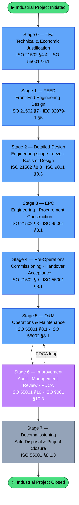

---

## The Problem

At the industrial (plant/facility/EP oilfield) project justification stage, there is a critical need for empirical data, guiding documentation, and foundational decisions that will shape the project's development. These early choices can ultimately determine either the failure or the economic success of the enterprise.

In practice, organizations often proceed with launching low-budget pilot versions of projects. However, limited resources frequently result in poor-quality documentation and suboptimal outcomes. While project execution methodologies have long been established, success largely depends on how consistently and accurately teams follow clear procedural steps to build an integrated project management system.

Despite the existence of fully standardized processes, there is still no interactive system capable of supporting key specialists in real time — providing intelligent guidance and acting as a companion that can efficiently navigate extensive, widely published yet fragmented standardization sources.

**Artificial intelligence can address this gap** by serving as a network of specialized, fine-tuned agents, each designed for a specific purpose and trained on organization-specific documentation stored on corporate servers or within secure enterprise on-line platforms.

---

## Our Solution: From Hook to Factory
**Project Overview: AI-Agent Structural Integration**

**The Core Concept and Know-How**
The key innovation of this project lies in its unique organizational structure and the precisely defined functional tasks assigned to individual AI agents. Each agent specializes in high-precision, niche solutions within its specific domain. Effectively, these agents execute the routine duties typically performed by human engineers, but with a guaranteed, predictable outcome. This enables their integration into a unified, task-oriented workflow that complies with the **ISO 55001** standard, ensuring that all agents operate within a synchronized system and a single structural unit, striving toward a common objective.

**Uniqueness and Practical Foundation**
The uniqueness of this solution is rooted in its application of real-world data from successful, existing projects. It has been developed based on the practical expertise of specialists who have a proven track record of launching complex projects.

**Standardization and Certification**
The framework is built upon the well-established ISO 55001 asset management standard and adheres to the **ISO 55002** guidelines. This strict alignment with international standards provides a clear roadmap for formal system certification, ensuring operational reliability and global compatibility.

**Operational Logic of the Standard**
The implementation of the standard follows this sequence:

**Defining the Scope:** The process begins by establishing the "field of variation" (the operational scope).

**Strategic Alignment:** Define the Asset Management System (AIMS) philosophy, articulate project goals with stakeholders, and delineate investment areas.

**Functional Distribution:** Functional descriptions are assigned to departmental agents, and departmental provision documents are generated to codify these roles.

**System Integration:** Functionality is linked via an Interface Manager Agent. Specialized "Engineer Agents" are assigned to each department to generate supporting documentation for every function.

**Dynamic Management:** The entire ecosystem is supported by an Interface/Manager Agent whose primary task is to orchestrate functional interactions. Any modification of these interactions automatically updates the documentation for all subordinate functions.

---

## 🏗 Factory Architecture & Development Roadmap
The project evolves through a hierarchical deployment of specialized agents, ensuring that operational execution always follows strategic integrity.

---

### Diagram 1 — AxiOMSphere Agent Type Registry

> 7 universal agent types deployed across all departments of any Plant Project.
> Each type runs in parallel instances within different functional domains simultaneously.

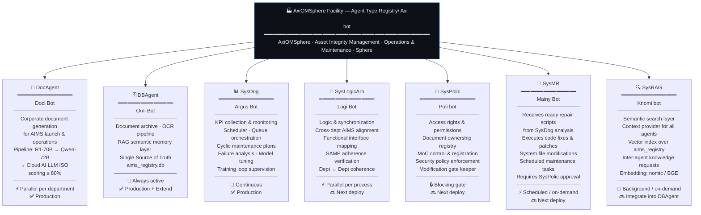

---

### Diagram 2 — Plant Project Development Sequence
#### From General to Specific · ISO 55001:2024 / ISO 55002:2018

> Sequence verified against ISO 55001 clause structure:
> §4 Context → §5 Leadership → §6 Planning → §7 Support → §8 Operation → §9 Evaluation → §10 Improvement
```mermaid
flowchart TD
    START(["🏗️ PLANT PROJECT START\nGreenfield / New Enterprise"])

    S0["📋 Stage 0 · TEJ\nTechnical-Economic Justification\nISO §4.1 Context · §4.2 Stakeholders · §4.3 Scope\n─────────────────────────────────\nFeasibility study & business case\nStakeholder identification & requirements\nDefine AMS scope & field of variation\nInvestment decision & project approval"]

    S1["🔭 Stage 1 · Pre-FEED\nConceptual Engineering\nISO §5.2 Policy · §6.2 Objectives\n─────────────────────────────────\nConcept selection & screening\nHigh-level cost estimate Class 5\nProject Scope Definition\nAIMS philosophy & objectives alignment\nInitial risk register"]

    S2["🎯 Stage 2 · FEED\nFront End Engineering Design\nISO §5 Leadership · §6 Planning\n─────────────────────────────────\nBasis of Design (BoD)\nProcess Flow Diagrams (PFD) · P&IDs\nHAZOP · Safety studies\nEquipment list · Datasheet package\nCost estimate Class 3\nProject Execution Plan (PEP)\nSAMP — Strategic Asset Mgmt Plan §6.2\nOrganizational structure · RACI §5.3\nFEED Package → EPC tender basis"]

    S3["🔍 Stage 3 · DD\nDetail Design\nISO §7 Support · §6.1 Risk\n─────────────────────────────────\nGap analysis vs ISO 55001 requirements\nAsset inventory & criticality assessment\nCompetency assessment & training plan §7.2\nData standards & ownership §7.5\nContractor qualification & selection\nEPC contract award"]

    S4["⚙️ Stage 4 · EPC\nEngineering · Procurement · Construction\nISO §8.1 Operational Planning · §8.3 Outsourcing\n─────────────────────────────────\nDetailed engineering · Vendor packages\nProcurement control & supplier qualification\nConstruction · QA/QC · Inspection\nPunch list A & B management\nAsset register build · Tag numbers\nMC Dossier preparation · As-built drawings"]

    S5["🚀 Stage 5 · Commissioning & Startup\nMC → Commissioning → RFSU → PAC → FAC\nISO §8.2 Asset Mgmt Plans · §8.4 Change Mgmt\n─────────────────────────────────\nMC: Mechanical Completion · Punch list A cleared\nCommissioning: Pre-startup audit · System checks\nRFSU: Ready For Start-Up · Performance tests\nPAC: Provisional Acceptance · Final documentation\nFAC: Final Acceptance · Defects correction closure\nSOP development · MoC activation · Permit-to-work\nHandover dossiers Books A–L"]

    S6["🏭 Stage 6 · Operation & Maintenance\nISO §8 Operation · §9 Evaluation · §10 Improvement\n─────────────────────────────────\nOperational control & monitoring §8.1\nPreventive & predictive maintenance strategies\nRBI · NDT · Risk-based inspection planning\nKPI tracking & performance review §9.1\nIncident investigation · RCA · Lessons learned §10.1\nInternal & external audits · ISO 55001 certification §9.2\nContinuous improvement · SAMP update · PDCA loop"]

    DONE(["✅ AIMS FULLY OPERATIONAL\nISO 55001 Certified Enterprise"])

    START --> S0 --> S1 --> S2 --> S3 --> S4 --> S5 --> S6 --> DONE

    S6 -.->|"PDCA Loop · Plan → Do → Check → Act"| S2

    style START fill:#1a1a2e,stroke:#4fc3f7,color:#fff
    style S0 fill:#0a1628,stroke:#4fc3f7,color:#b3e5fc
    style S1 fill:#0d2b0d,stroke:#69f0ae,color:#ccff90
    style S2 fill:#0a2010,stroke:#66bb6a,color:#c8e6c9
    style S3 fill:#1c1a00,stroke:#ffca28,color:#fff9c4
    style S4 fill:#1c0e00,stroke:#ffa726,color:#ffe0b2
    style S5 fill:#1c0000,stroke:#ef5350,color:#ffcdd2
    style S6 fill:#0d1b33,stroke:#42a5f5,color:#bbdefb
    style DONE fill:#003300,stroke:#66bb6a,color:#e8f5e9
```

### Diagram 3A — Agent Build, Test & Tuning Sequence (Flowchart):

```mermaid
flowchart TD
    START(["🏭 AxiOMSphere Factory\nAgent Build · Test · Tune Program"])

    subgraph PROD["✅ PRODUCTION — Already Built & Testing"]
        P1["📄 Axi Bot · DocAgent\n─────────────────\nBuild: DeepSeek-R1-70B → Qwen2.5-72B → Cloud API LLM pipeline\nTest: ISO compliance score ≥ 80%\nTune: qwen2.5-14B · 6 cycles done ✅\nNext: qwen2.5-72B tuning 🔄\nTarget: score ≥ 0.85 · latency < 10 min"]
        P2["🗄️ Omi Bot · DBAgent\n─────────────────\nBuild: OCR pipeline + aims_registry.db\nTest: Document registration accuracy\nTest: RAG semantic search precision\nTune: Embedding model nomic/BGE\nTarget: retrieval precision ≥ 90%"]
        P3["📊 Argus Bot · SysDog\n─────────────────\nBuild: DevOps monitor + queue scheduler\nTest: KPI collection · Alert triggers\nTest: Training loop gold/DPO pairs\nTune: Failure detection thresholds\nTarget: uptime ≥ 99.5% · MTTR < 5 min"]
        P4["📄 DocAgent · standalone\n─────────────────\nBuild: Independent doc generation module\nTest: Multi-format output · DOCX quality\nTest: ISO clause mapping accuracy\nTune: Prompt templates per doc type\nTarget: ISO score ≥ 0.80 on all doc types"]
    end

    START --> PROD

    PROD --> GATE1{{"🔒 Gate 1\nProduction agents stable?\nScore targets met?\nArgus monitoring active?"}}

    GATE1 -->|"❌ Fail"| FIX1["🔧 Failure Analysis Loop\n─────────────────\nSysDog collects failure logs\nRCA — Root Cause Analysis\nGenerate fix scripts\nRetune model · Retest\nUpdate gold_pairs.jsonl"]
    FIX1 --> GATE1

    GATE1 -->|"✅ Pass"| NEXT1

    subgraph NEXT1["🔜 NEXT DEPLOY — Phase 3"]
        N1["🧠 SysLogicArh\n─────────────────\nBuild: AIMS sync engine\nInterface mapping logic\nTest: Cross-dept doc coherence\nTest: SAMP alignment verification\nTest: Dept ↔ Dept conflict detection\nTfine-tuning: Qwen2.5-72B with crosscheck DeepSeel-R1:70B on AIMS corpus\nTarget: 0 logic conflicts in 100 docs"]
        N2["🔐 SysPolic\n─────────────────\nBuild: Rights & permissions engine\nMoC registration module\nTest: Access control enforcement\nTest: Document ownership tracking\nTest: Change approval workflow\nTfine-tuning: Qwen2.5-72B with crosscheck DeepSeel-R1:70B\Policy rule base fine-tuning\nTarget: 100% MoC compliance · 0 breaches"]
    end

    NEXT1 --> GATE2{{"🔒 Gate 2\nSysLogicArh coherence ≥ 95%?\nSysPolic 0 access breaches?\nMoC workflow validated?"}}

    GATE2 -->|"❌ Fail"| FIX2["🔧 Failure Analysis Loop\n─────────────────\nLog conflict patterns\nRCA on policy violations\nRetune logic rules\nRetest full workflow"]
    FIX2 --> GATE2

    GATE2 -->|"✅ Pass"| NEXT2

    subgraph NEXT2["🔜 NEXT DEPLOY — Phase 4"]
        N3["🔧 SysMR\n─────────────────\nBuild: Script execution engine\nScheduled maintenance runner\nTest: Script safety validation\nTest: Rollback on failure\nTest: SysPolic approval gate\nTest: Scheduled task accuracy\nTune: R1-70B on repair corpus\nTarget: 0 unauthorized changes\n100% rollback success on fail"]
        N4["🔍 SysRAG\n─────────────────\nBuild: Vector index over aims_registry\nSemantic search API for agents\nTest: Retrieval relevance score\nTest: Inter-agent query response\nTest: Context window optimization\nTune: nomic-embed · BGE models\nTarget: relevance ≥ 0.90\nlatency < 2 sec per query"]
    end

    GATE2 --> NEXT2

    NEXT2 --> GATE3{{"🔒 Gate 3\nSysMR 0 unauthorized changes?\nSysRAG relevance ≥ 0.90?\nAll 7 agents integrated?\nOrchestrator routing stable?"}}

    GATE3 -->|"❌ Fail"| FIX3["🔧 Failure Analysis Loop\n─────────────────\nFull system integration test\nEnd-to-end doc generation test\nRCA on integration failures\nTune all models · Retest"]
    FIX3 --> GATE3

    GATE3 -->|"✅ Pass"| DONE

    subgraph TUNE["🔄 Continuous Tuning Loop — All Stages"]
        T1["qwen2.5-14B\n6 cycles done ✅\nBaseline established"]
        T2["qwen2.5-72B\nIn progress 🔄\nTarget: score ≥ 0.85"]
        T3["deepseek-r1:70b\nNext after 72B\nTarget: draft quality +15%"]
        T4["Cloud API LLM/Pro\nISO scoring gate\nTarget: 0.0–1.0 calibrated"]
        T1 --> T2 --> T3
        T3 -.->|"scoring"| T4
    end

    TUNE -.->|"feeds improvement"| FIX1 & FIX2 & FIX3

    DONE(["✅ AxiOMSphere FULLY OPERATIONAL\n7 Agents · ISO 55001 Compliant\nCorporate Bot Factory Ready"])

    style START fill:#0d1117,stroke:#58a6ff,color:#e6edf3
    style DONE fill:#003300,stroke:#66bb6a,color:#e8f5e9
    style GATE1 fill:#1c1a00,stroke:#ffca28,color:#fff9c4
    style GATE2 fill:#1c1a00,stroke:#ffca28,color:#fff9c4
    style GATE3 fill:#1c1a00,stroke:#ffca28,color:#fff9c4
    style FIX1 fill:#1c0000,stroke:#ef5350,color:#ffcdd2
    style FIX2 fill:#1c0000,stroke:#ef5350,color:#ffcdd2
    style FIX3 fill:#1c0000,stroke:#ef5350,color:#ffcdd2
    style PROD fill:#003300,stroke:#66bb6a,color:#c8e6c9
    style NEXT1 fill:#0a1628,stroke:#4fc3f7,color:#b3e5fc
    style NEXT2 fill:#1a0a2e,stroke:#9c6df4,color:#e9d5ff
    style TUNE fill:#1b0033,stroke:#ce93d8,color:#f3e5f5
```


## Diagram 3B — AxiOMSphere Deployment Roadmap (Gantt): AxiOMSphere
### AxiOMSphere / AIMS — Master Deployment Roadmap 

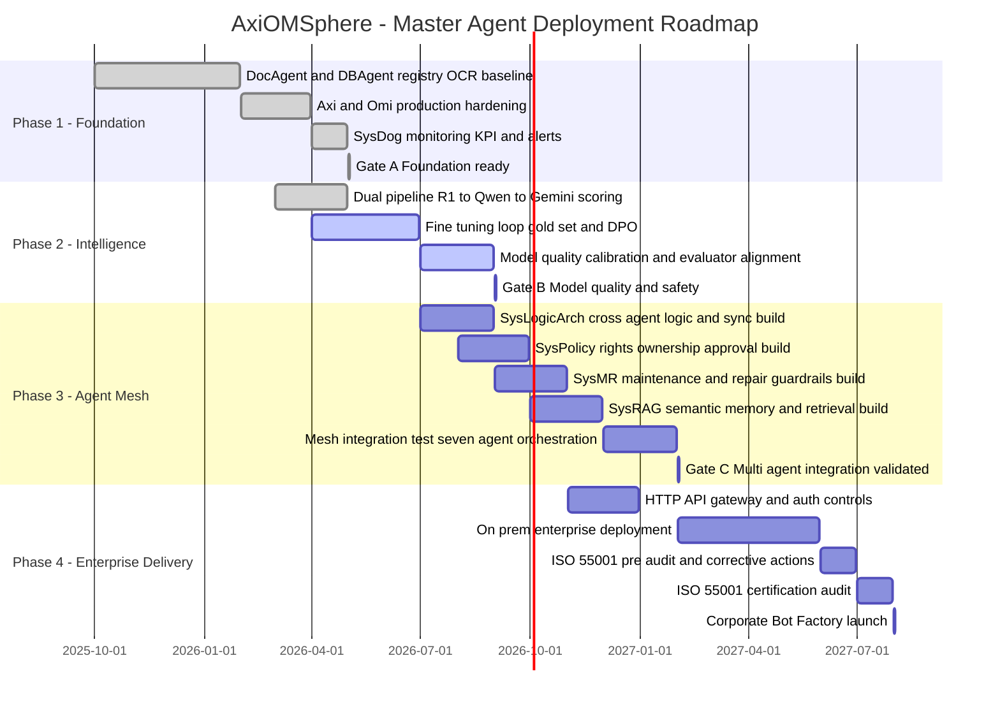

### Gate KPI Criteria

- **Gate A — Foundation ready**
  - OCR/register->sync success rate >= 98% for 30 days.
  - P95 document retrieval latency <= 5s for top workflows.
  - SysDog alerting active with owner response runbook.

- **Gate B — Model quality and safety**
  - Retrieval relevance >= 0.85 on validation set.
  - Structured action format compliance >= 95%.
  - Hallucination rate in critical document answers <= 3%.

- **Gate C — Multi-agent integration validated**
  - 7-agent orchestration pass rate >= 95% on scenario suite.
  - Zero critical access-control violations (SysPolicy).
  - Cross-agent handoff completion <= 15s P95.

- **Gate D — Enterprise launch readiness**
  - UAT sign-off by operations + QA + document control leads.
  - MTTR for platform incidents <= 30 minutes in pilot.
  - Audit nonconformities closed or formally accepted.

### Gate Flow (for pitch deck)

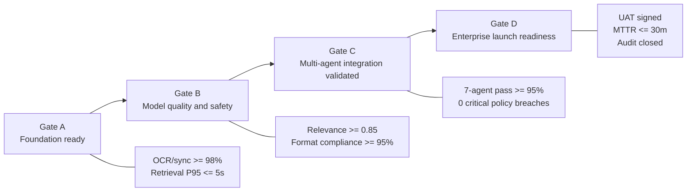
## Industrial Project Escalation

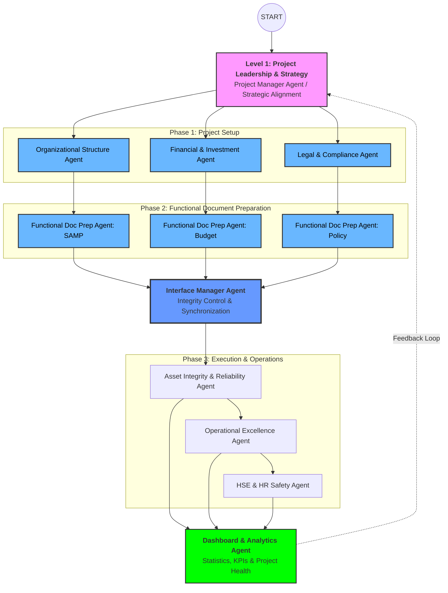

## Document Generation Agent Structure

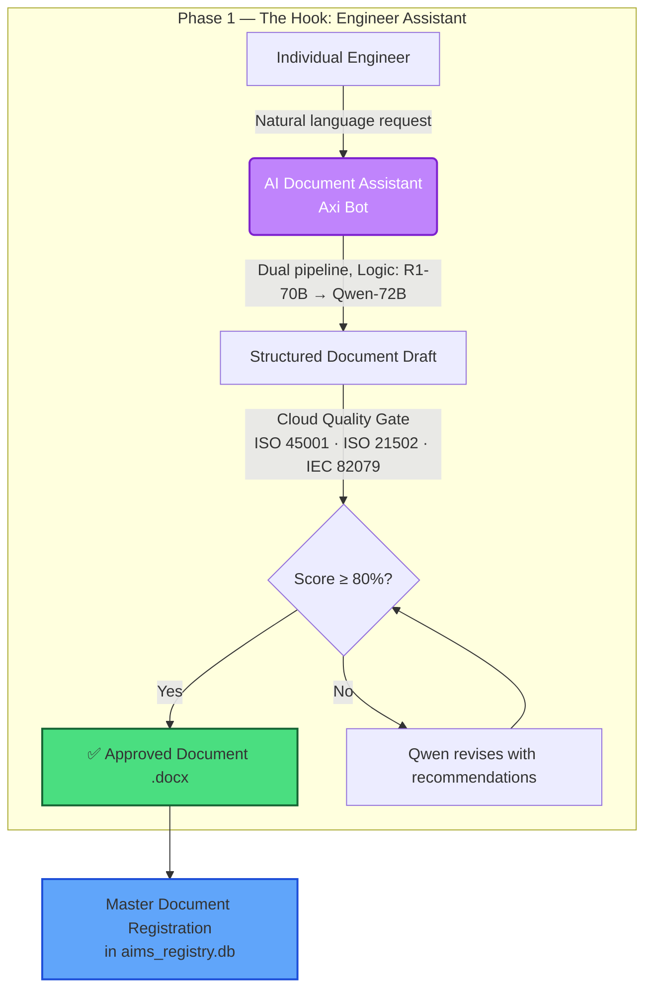


---

## 🟢 Live System Architecture
> What is built and running **today** with real engineers

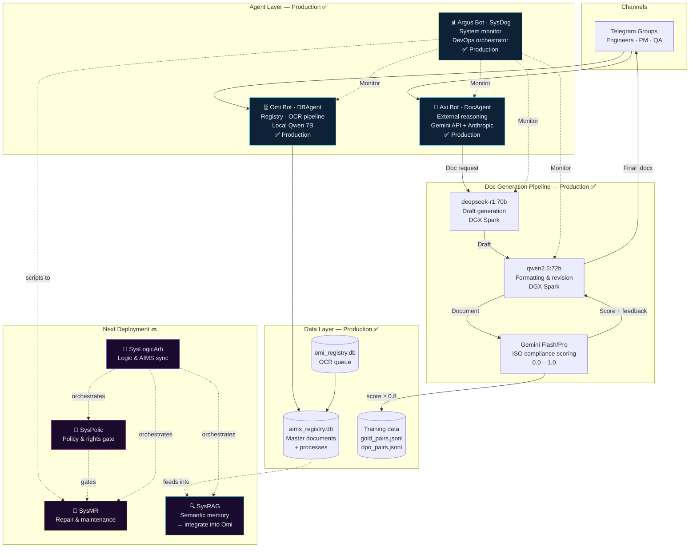

---

## GPU Cluster Topology

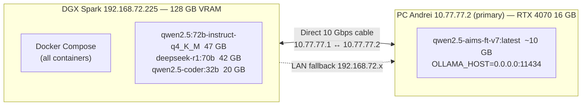

| Node | IP (primary) | IP (fallback) | VRAM | Hosted models |
|------|-------------|--------------|------|---------------|
| **DGX Spark** | `192.168.72.225` | — | 128 GB | 72B, 70B, 32B |
| **PC Andrei** | `10.77.77.2` | `192.168.72.134` | 16 GB | 14B FT only |

**Routing rules** (`ops/ollama_resolve.py`):
- Small models (`qwen2.5-aims-ft-v*`) → **PC Andrei only** — blocked on DGX via `argus_ollama.py`
- Heavy models (70B+) → **DGX only** — two 70B+ models never loaded simultaneously
- `OLLAMA_RESOLVE_TTL_SEC=30` — caches ping results; prevents ~6 s latency when DGX unreachable

---

## Production Bot Fleet — Technical Reference

### Omi — Document Administrator (`@OmiSphere_bot`)
`ops/omi_telegram/omi_bot.py`

| Capability | Detail |
|-----------|--------|
| Document intake | Telegram: PDF, DOCX, images → OCR → registry |
| Classification | ISO 55001 / P-codes (P00–P07) via FT model |
| Search | Hybrid: FTS + semantic Qdrant (nomic-embed-text) |
| Document synthesis | RAG → DocAgent → `.docx` → Telegram |
| Anonymization | Strips company/person names before storing |
| Cross-bot handoff | Delegates tasks to Axi |
| Night self-test | `omi_selftest.py` — verifies pipeline integrity |
| DB backup | Copies `aims_registry.db` to PC Andrei via sshfs |

**Models:** `qwen2.5-aims-ft-v7` (PC Andrei 14B, routing) + `qwen2.5:72b` (DGX, synthesis)  
**NLP commands (12):** `status`, `tasks`, `search`, `docs_today`, `registry_sync_status`, `move`, `archive`, `backup_now`, `backup_list`, `nightplan`, `skills`, `selftest`

---

### Axi — Orchestrator & Quality Monitor (`@AXI_bot`)
`ops/axi_bot.py`

| Capability | Detail |
|-----------|--------|
| Web search | Gemini Grounding — real-time web results |
| Task orchestration | Routes tasks to Omi; monitors Task Registry |
| Stuck task alerts | Detects tasks >15 min stuck → Telegram alert |
| Document generation | `/doc` → DocAgent pipeline |
| OCR after upload | Auto-triggers OCR on file messages |
| CV processing | `cv_pipeline.py` — match CV to vacancies |
| ISO classification | GPT-4o-mini analysis of document type |
| Voice messages | `axi_voice.py` — STT/TTS |
| Video generation | Veo/Gemini — `skill_gemini_video.py` |

**Models:** Gemini 2.5-flash (primary) + Anthropic Claude (fallback) + Qwen local  
**NLP commands (3):** `quality_report`, `stuck_tasks`, `analyze`

---

### Argus — Infrastructure Guardian (`@AIMS_argus_bot`)
`ops/argus/argus_bot.py`

| Capability | Detail |
|-----------|--------|
| Container monitoring | Every 30 s — crash / hang / OOM detection |
| VRAM monitoring | Every 60 s — DGX + PC Andrei Ollama |
| Task Registry watch | Every 5 min — stuck tasks >15 min |
| Telegram alerts | Inline buttons: [Restart] / [Diagnose] / [Ignore] |
| AI diagnostics | `argus_code_agent.py` — Claude/Gemini/local backend |
| Auto-restart | Max 3× per hour per container |
| YAML orchestrator | Executes `aims_weekly.yaml` night plan |
| Keepalive management | On-demand lifecycle: batch-ingest, litellm, ocr, job-filter |
| Fine-tuning launch | SSH to DGX or local nohup |
| VRAM policy | Blocks small models on DGX, large on PC Andrei |

**Models:** `qwen2.5-coder:32b` (DGX) + `qwen2.5-aims-ft-v7` (PC Andrei)  
**NLP commands (18):** `status`, `models`, `installed`, `logs`, `restart`, `rebuild`, `stop`, `up`, `load`, `unload`, `tasks`, `incidents`, `diagnose`, `dgx`, `wake`, `sleep`, `digest`, `plan`

---

## NLP Intent Routing

All 3 bots use `ops/chat_intent_router.py` — a local small Qwen 14B classifier that converts free-text messages into slash commands **before** any LLM fallback:

```mermaid
flowchart LR
    MSG["💬 Free-text message"] --> ROUTER["chat_intent_router.py\nLocal FT Qwen 14B\n(PC Andrei)"]
    ROUTER -->|"(cmd, args)"| CMD["Direct command handler\ncalled with ctx.args"]
    ROUTER -->|"no match"| LLM["LLM fallback\n(Gemini / Qwen 72B)"]
    style ROUTER fill:#1a2f4a
    style CMD fill:#1a4731
```

---

## Data Pipeline

```mermaid
flowchart TD
    A["👤 User sends file via Telegram"] --> B["inbox/income/"]
    B --> C["OCR Watcher (GPU container)"]
    C --> D["outbox/ (extracted text)"]
    D --> E{"Quality Gate\nsimilarity ≥ 90%?"}
    E -->|"✅ pass"| F["aims_registry.db\n+ Qdrant embedding"]
    E -->|"❌ fail"| G["inbox/Skipped/"]
    F --> H["RAG Search (user queries)"]
    H --> I["DocAgent — Qwen 72B DGX"]
    I --> J["generated/*.docx → Telegram"]

    style F fill:#1a4731
    style G fill:#4a1515
    style I fill:#1a2f4a
```

---

## Doc Generation Pipeline

The core AI loop — **R1 → Qwen → Gemini** — runs today on DGX Spark hardware:

| Stage | Model | Role | Avg. Time |
|-------|-------|------|-----------|
| **Draft** | deepseek-r1:70b | Structural reasoning, ISO-aware outline | ~5 min |
| **Format** | qwen2.5:72b | Professional formatting, section rewrite | ~3 min |
| **Score** | Gemini Flash/Pro | ISO compliance 0.0–1.0, gap feedback | ~15 sec |
| **Revise** | qwen2.5:72b | Targeted revision using Gemini feedback | ~2 min |

**Quality gate:** <60% → reject + retry · ≥60% → accepted · target **98% compliance**  
**Training loop baked in:** every run produces `gold_pairs.jsonl` (score ≥ 0.8) and `dpo_pairs.jsonl` — no opt-in flags needed.

---

## Fine-Tuning Pipeline

```mermaid
flowchart TD
    DOCS["📄 Domain documents\ninbox/training/"] --> INGEST["00:01 training_ingest_new_docs"]
    INGEST --> PAIRS["00:30 training_generate_pairs\n72B LLM on DGX (~60–90 min)"]
    PAIRS --> STATUS["01:00 training_dataset_status"]
    STATUS --> FT["02:30 ft_prepare_chain_run\n14B → 70B → 72B sequential\n(2 h buffer after pair gen)"]
    FT --> DEPLOY["05:30 daily_deploy_14b_andrei\nblob-push to PC Andrei Ollama"]
    DEPLOY --> BOT["✅ qwen2.5-aims-ft-vN:latest\nactive on PC Andrei"]

    style PAIRS fill:#1a2f4a
    style FT fill:#1a2f4a
    style BOT fill:#1a4731
```

**Model versioning:** `vN` or `vNrM` — e.g. `v7`, `v7r1`, `v7r2`, `v8`, `v8r1`

| Version | Base | Status |
|---------|------|--------|
| v1–v5 | Qwen2.5:14B | Complete |
| v6 | Qwen2.5:14B | Complete — `qwen2.5-aims-ft-v6` |
| **v7, v7r1, v7r2** | Qwen2.5:14B | **Current (PC Andrei)** |
| v8+ | Qwen2.5:14B | Planned |

---

## Night Schedule (Automated)

Orchestrated by **Argus** via `ops/argus/plans/aims_weekly.yaml`:

```mermaid
gantt
    title AIMS Night Pipeline
    dateFormat HH:mm
    axisFormat %H:%M

    section Pre-checks
    pre_docbench_check VRAM unload   : 22:30, 30m

    section DocBench
    docbench_nightly quality test    : 23:00, 60m

    section Training
    training_ingest_new_docs         : 00:01, 29m
    training_generate_pairs 72B      : 00:30, 90m
    training_dataset_status          : 01:00, 30m

    section Fine-Tuning
    ft_prepare_chain_run 14B to 72B  : 02:30, 180m

    section Deploy
    daily_deploy_14b_andrei          : 05:30, 30m
```

> **GPU conflict fix:** `ft_prepare_chain_run` shifted 01:20 → **02:30** — 2h buffer after `training_generate_pairs` (72B, 60–90 min on DGX GPU).

---

## Model Reference

| Model | Size | Node | Role |
|-------|------|------|------|
| `qwen2.5-aims-ft-v7:latest` | ~10 GB | PC Andrei | Routing / classification (current FT) |
| `qwen2.5-aims-ft-v6` | ~10 GB | PC Andrei | Routing / classification (legacy) |
| `qwen2.5:72b-instruct-q4_K_M` | 47 GB | DGX (cold) | DocAgent synthesis, training pair gen |
| `deepseek-r1:70b` | 42 GB | DGX (cold) | DocAgent Stage 1 reasoning |
| `qwen2.5-coder:32b` | 20 GB | DGX (warm) | Argus chat / code / diagnostics |

**VRAM policy:** Two 70B+ models never simultaneously. Small 14B → PC Andrei only. Max safe load: one 70B + 14B ≤ 80 GB.

---

## Standards We Align With

| Standard | Scope |
|----------|-------|
| **ISO 55001:2024** | Asset management — Management systems — Requirements |
| **ISO 55002:2018** | Asset management — Guidelines for the application of ISO 55001 |
| **ISO 21502:2020** | Project management guidance |
| **ISO 21500:2021** | Project, programme and portfolio management concepts |
| **IEC/IEEE 82079-1:2019** | Preparation of information for use — technical documentation |
| **ISO 9001 §7.5** | Control of documented information |
| **ISO 45001** | Occupational health and safety management |
| **API RP 505** | Fire protection for refineries |

---

## ISO 55001 Clause Mapping to Plant Project Stages

| ISO 55001 Clause | Requirement | Plant Project Stage |
|------------------|-------------|---------------------|
| §4.1–4.3 | Context, stakeholders, scope | TEJ |
| §5.1–5.3 | Leadership, policy, roles | FEED |
| §6.1–6.2 | Risk framework, SAMP, objectives | FEED → DD |
| §7.1–7.5 | Resources, competence, documentation | DD → EPC |
| §8.1–8.4 | Operations, asset plans, MoC | EPC → PO → O&M |
| §9.1–9.3 | Monitoring, audit, management review | O&M |
| §10.1–10.3 | Improvement, corrective action | O&M → continuous |

---

## Document & OCR Pipeline

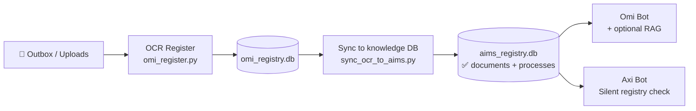

---

## Minimal Code Example

```python
from doc_agent import DocAgent, DocGenerationRequest

agent = DocAgent()

result_path, preview, score, feedback = agent.generate(
    DocGenerationRequest(
        user_request="Create a Job Safety Analysis for confined space entry at an underground mine. "
                     "Reference ISO 45001. Include hazard table, controls hierarchy, permit conditions.",
        dual_pipeline=True,   # R1-70B → Qwen-72B → Gemini quality gate
    )
)

print(f"Document: {result_path}")
print(f"ISO compliance score: {score:.0%}")
print(f"Feedback: {feedback}")
# → Document: /data/JSA_confined_space_entry.docx
# → ISO compliance score: 84%
# → Feedback: Document covers all required JSA sections with complete hazard controls matrix.
```

---

## Use Cases

| Use Case | Document Type | Standard |
|----------|---------------|----------|
| Confined space entry | Job Safety Analysis (JSA) | ISO 45001 |
| H2S release at gas plant | Emergency Response Procedure | API RP 505 |
| Fan replacement in mine | Management of Change (MOC) | ISO 45001 §8.1.3 |
| Project kick-off | Project charter + WBS | ISO 21502 |
| Technical manual | User documentation | IEC 82079-1 |

---

## Directory Structure

```
aims-workspace/
├── ops/
│   ├── axi_bot.py                # Axi bot (Telegram)
│   ├── job_filter_bot.py         # JobLocator bot
│   ├── doc_agent.py              # DocAgent: document generation
│   ├── doc_agent_api.py          # FastAPI DocAgent server (:8767)
│   ├── ollama_resolve.py         # Ollama URL router (DGX ↔ PC)
│   ├── chat_intent_router.py     # NLP free-text → slash command
│   ├── omi_quality_gate.py       # OCR quality control
│   ├── omi_batch_ingest.py       # Batch document ingest
│   ├── omi_telegram/
│   │   ├── omi_bot.py
│   │   ├── omi_agent.py          # LLM + RAG intelligence
│   │   ├── omi_doc_synthesis.py  # RAG → LLM → DOCX pipeline
│   │   ├── omi_rag.py            # Qwen-Agent Memory + retrieval
│   │   ├── omi_storage.py        # StorageManager (SQLite)
│   │   ├── omi_api.py            # REST API (:8765)
│   │   └── omi_backup.py         # DB backup
│   ├── argus/
│   │   ├── argus_bot.py
│   │   ├── argus_monitor.py
│   │   ├── argus_orchestrator.py # YAML plan executor
│   │   ├── argus_ollama.py       # Per-node model management
│   │   ├── argus_code_agent.py   # AI diagnostics
│   │   └── plans/aims_weekly.yaml
│   └── ft/
│       ├── configs/              # Training configs (14B, 70B, 72B)
│       └── output/               # Checkpoints v1–v7
├── aims_workspace/               # Data (bind-mounted as /data)
│   ├── inbox/income/             # Incoming docs from Telegram
│   ├── inbox/.ocr_queue/         # OCR queue
│   ├── inbox/Skipped/            # Quality-gate rejects
│   ├── generated/                # Generated .docx files
│   └── aims_registry.db          # Master document registry
├── set_andrei_direct_cable_private.ps1  # PC Andrei startup (Windows)
├── docker-compose.yml
└── .env
```

---

## Key Services & Ports

| Service | Container | Port | Notes |
|---------|-----------|------|-------|
| DocAgent API | `axiomsphere-doc-agent` | **8767** | FastAPI |
| Omi REST API | `axiomsphere-omi-api` | 8765 | Internal |
| Task Registry | `axiomsphere-task-registry` | 8765 (127.0.0.1) | FastAPI |
| Qdrant | `axiomsphere-qdrant` | **6333** | Vector DB |
| LiteLLM Proxy | `axiomsphere-litellm` | 4400 | Gemini ×4 keys + Anthropic |
| Prometheus | `axiomsphere-prometheus` | 9090 | DGX metrics |
| Grafana | `axiomsphere-grafana` | 3000 | Dashboard |
| FlareSolverr | `axiomsphere-flaresolverr` | 8191 | Cloudflare bypass |

---

## Deployment

```bash
# Start all bots (on DGX host)
docker compose --profile telegram-bots up -d

# Restart individual bot
docker compose restart argus-bot
docker compose restart omi-bot
docker compose restart axi-bot
```

**PC Andrei — fix Windows network profile (run once as Admin):**
```powershell
# Windows puts the 10G direct cable in "Public" on reboot → blocks port 11434
# This task keeps it "Private" so DGX can reach small Qwen model
$action  = New-ScheduledTaskAction -Execute "powershell.exe" `
             -Argument "-NonInteractive -WindowStyle Hidden -ExecutionPolicy Bypass -File E:\aims-workspace\set_andrei_direct_cable_private.ps1"
$trigger = New-ScheduledTaskTrigger -AtStartup
Register-ScheduledTask -TaskName "AIMS_SetDirectCablePrivate" `
  -Action $action -Trigger $trigger -RunLevel Highest -User "SYSTEM" -Force
```

---

## Change Log — Audit 2026-04-24

| # | Change | Files |
|---|--------|-------|
| A | Removed `gpus` from `ocr-watcher` and `omi-register` (CPU-only services) | `docker-compose.yml` |
| B | Added `pre_docbench_unload.py` + 22:30 step to unload VRAM before DocBench | `ops/scripts/`, `aims_weekly.yaml` |
| C | `effective_small_qwen_ollama_base_url()` tries PC Andrei first, DGX as fallback | `ops/ollama_resolve.py` |
| D | `weekly_model_upgrade.py` → blob-deploy for 14B to PC Andrei Ollama | `ops/scripts/` |
| E | `daily_deploy_14b_to_andrei.py` + `weekly_model_upgrade.py` support `vNrM` versioning | both scripts |
| F | PC Andrei network profile set to Private; `OLLAMA_HOST=0.0.0.0:11434` | Windows |
| G | `chat_intent_router.py` — NLP routing module created | `ops/chat_intent_router.py` |
| H | Intent router wired into all 3 bots (Argus 18 cmds, Omi 12, Axi 3) | all three bots |
| I | `OLLAMA_RESOLVE_TTL_SEC=30` — resolve cache to avoid 6s DGX timeout | `.env` |
| J | `QWEN_PC_ASSIST_WARM_ON_TELEGRAM=0` — disables redundant warm-up calls | `.env` |
| K | FT chain shifted 01:20 → **02:30** — 2h GPU buffer after training pair generation | `aims_weekly.yaml` |
| L | `set_andrei_direct_cable_private.ps1` — Windows Task Scheduler startup script | new file |

---

## Roadmap


---

## Repository Layout

```
AIMS-Agent-Orchestrator/
├── README.md                    ← this file
├── LICENSE                      (Apache-2.0)
├── docs/
│   ├── ARCHITECTURE.md          system design details
│   ├── DEMO_SCENARIO.md         step-by-step demo guide
│   ├── STANDARDS_MAPPING.md     ISO/IEC clause → agent capability
│   └── EMAILS_STARTUP_CREDITS.md
├── examples/
│   └── doc_agent_example.py     minimal usage example
└── docker-compose.yml           evaluation setup (optional)
```

---

## Grant Applications

We are seeking cloud credits / startup program support from:

| Program | Status | What we need |
|---------|--------|--------------|
| [Google for Startups Cloud Program](https://cloud.google.com/startup) | Applying | GPU compute for inference |
| [Microsoft Founders Hub](https://foundershub.startups.microsoft.com/) | Applying | Azure credits |
| [OpenAI Startup Program](https://openai.com/startups) | Applying | API credits |
| [NVIDIA Inception](https://www.nvidia.com/en-us/startups/) | Applying | DGX access / support |

---

## Demo

**Coming soon:** 60-second screen recording — engineer types a natural-language request → DocAgent dual pipeline → ISO-compliant `.docx` delivered to Telegram in under 10 minutes.

[📺 Watch Demo](#) · [🖼 Architecture Diagram](docs/ARCHITECTURE.md) · [🌐 Landing Page](https://axiomsphereaassistanceaims.github.io/AIMS-Agent-Orchestrator/)

---

## Contact

**Evgeny Shokk** — Founder, AIMS Platform

- 📧 Evgeny.shock@gmail.com
- 🌐 [Website](https://axiomsphereaassistanceaims.github.io/AIMS-Agent-Orchestrator/)
- 💼 [LinkedIn](https://www.linkedin.com/in/evgeny-shokk-54781716)

---

## License

[Apache License 2.0](LICENSE)

> Built on open-source: Python · Ollama · deepseek-r1 · Qwen2.5 · Google Gemini · python-telegram-bot · python-docx
