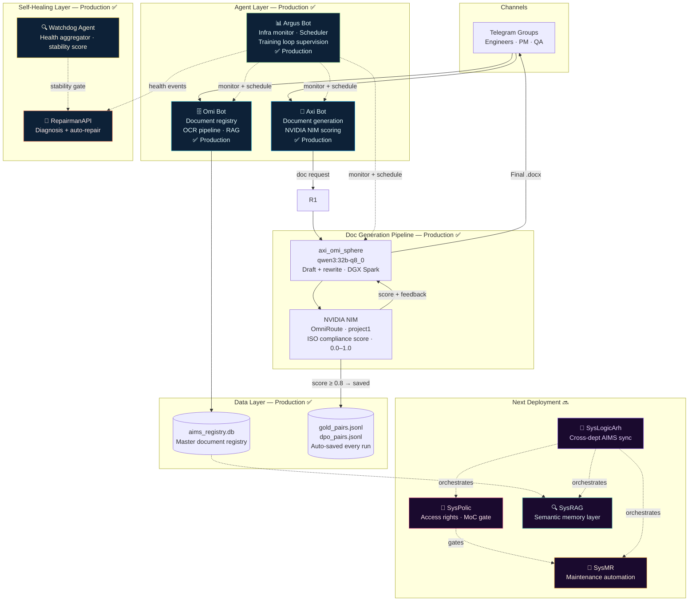
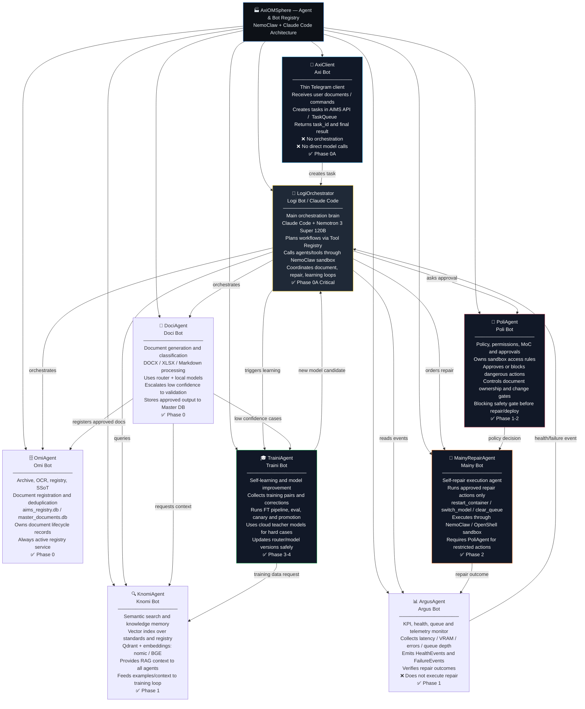
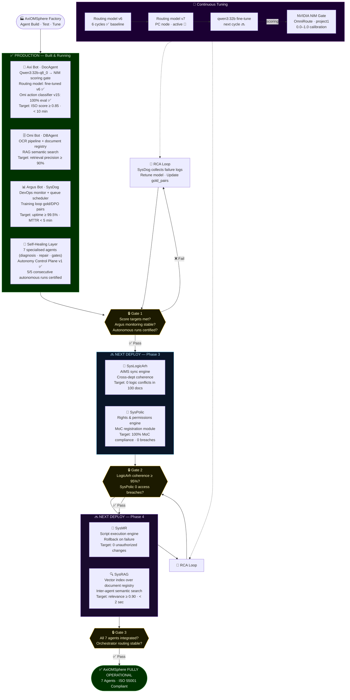
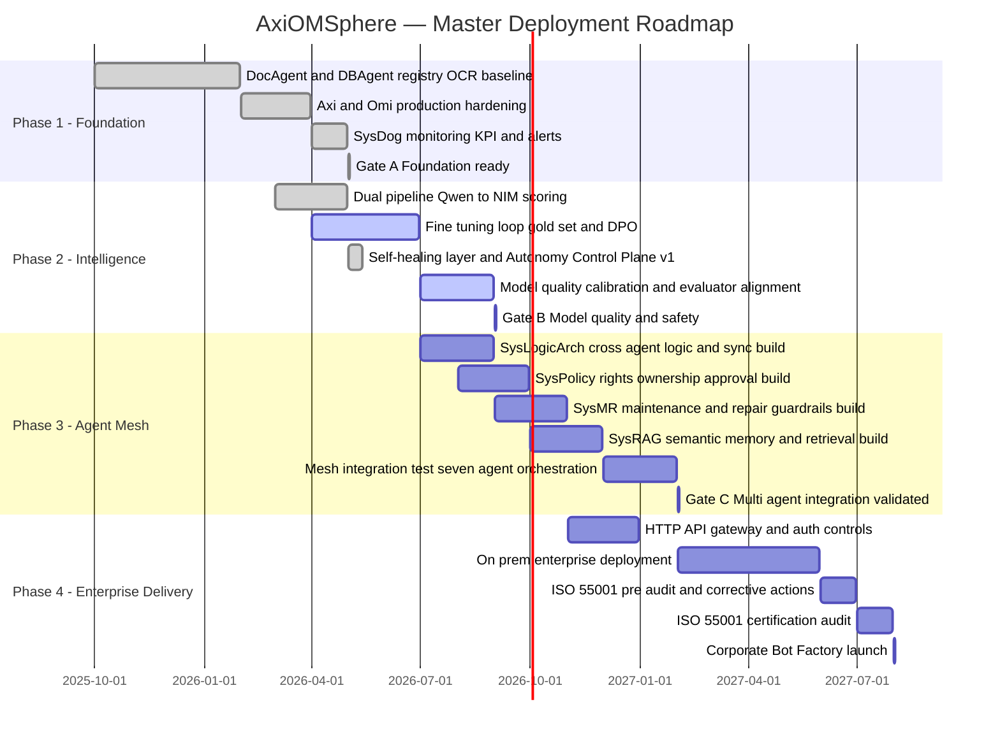
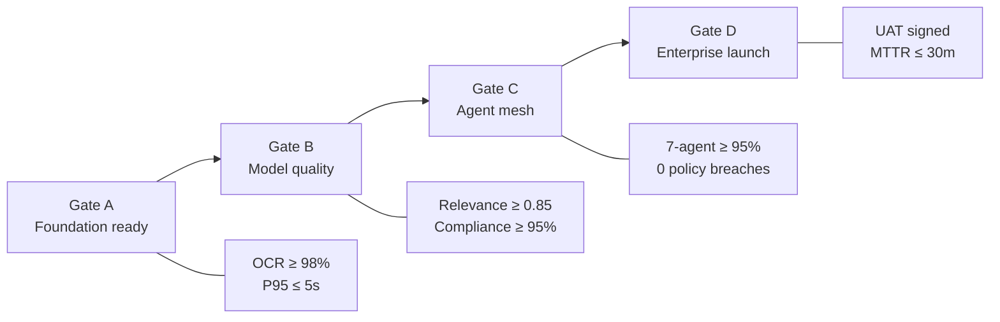
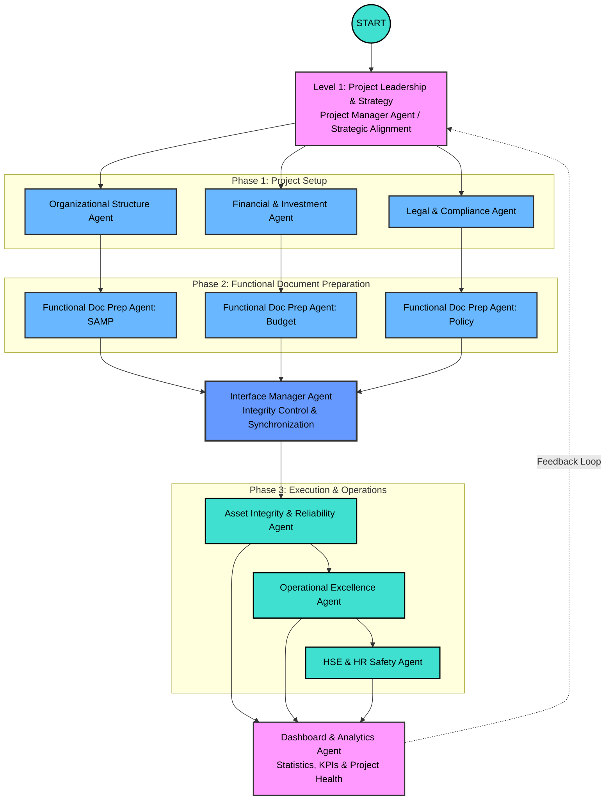
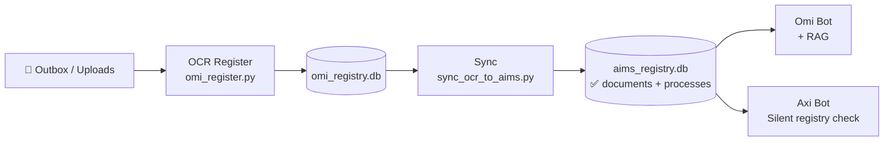
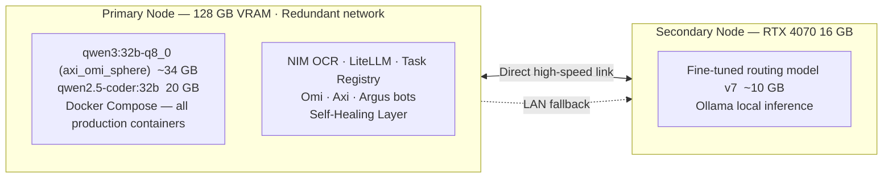

# AxiOMSphere
> **Multi-agent AI platform that automates industrial engineering workflows — from document generation to ISO compliance — using coordinated LLM agents running on private infrastructure.**

[🌐 Website](https://axiomsphereaassistanceaims.github.io/AIMS-Agent-Orchestrator/) · [📺 Demo](#demo) · [📬 Contact](#contact) · [📋 Apply for Credits](#grant-applications)

---

## What We Do

AxiOMSphere replaces manual project startup engineering work with coordinated AI agents. Each agent handles one function — document generation, quality control, registry management, infrastructure monitoring — and they operate as a continuous pipeline.

**The result is 1,5 year for 1 month:**
-  A document describing a business process, typically written in 2-3 days each by several specialists from different disciplines (recruited for a specific project), can be created in less than 10 minutes within an integrated functional system within a single functional area, in accordance with the AIMS project philosophy (a total of 1.5 years of work in 1 month). Even by non-experts or department heads, it allows for task assignments via chat, voice, or text, from any location. The database is based on several projects, providing valuable experience.
- ISO compliance verified automatically, not by hand
- Every generation run feeds back into model training — the system improves with every use

We're currently working in production with live engineers and actively scaling usage. We expect significant demand for the API in the next 1-3 months as the team expands and new types of documentation, tests, and cross-validations are added.

---

## Business Impact

| Before AxiOMSphere | With AxiOMSphere |
|-------------------|-----------------|
| 2–3 days to write a Oeration & Maintenance procedure | 5–10 minutes, reviewed and delivered to Telegram |
| 20 engineers / 2 DCC specialists / 5 department heads / 2 HR specialists to write 1000 procedures for 1.5 years | 5 engineers (hybrid work), 5-10 minutes, problem formulation 10 minutes, 1000 documents will be checked and sent to Telegram and saved in the database with full compliance with the company format and banding within 14 days |
| Any change in functionality in the vertical distribution chain will require a process of revising the upstream documents of 1000 procedures for 1.5 years | An integrated system capable of independently reviewing and comparing functionality and interface interactions is capable of restoring discrepancies in documents in a matter of hours, even without the process of revising them |
| ISO compliance checked manually, often skipped | Automated scoring 0.0–1.0, rewrite loop until ≥80% |
| Knowledge locked in PDFs on shared drives | Searchable, versioned, semantically indexed master documents registry |
| Model training requires a separate team | Every production run generates gold + DPO training pairs automatically |
| Infra issues noticed when users complain | Argus monitors 24/7, auto-restarts, alerts with one-click fix (every one has unic function) |

---

## Why We Need API Credits

AxiOMSphere is a **high-frequency, multi-agent system** where every user task decomposes into coordinated agent stages:

```
User request → Planning → Draft (Qwen3-32B) → Rewrite (Qwen3-32B) → Score (Gemini + Claude) → Revise → Register → Notify
```

Unlike a single-prompt application, **one document workflow requires 20–100+ LLM calls**:
- Complience agent: standart's identification by context (allocation for ISO55001/55002)
- Reasoning agent: structural outline + ISO clause mapping to standard ISO 9000:2015:
- Rewrite agent: professional formatting pass ISO 19005-1:2005
- Quality gate: compliance scoring + gap feedback
- Revision loop: targeted rewrites until score ≥ 80%
- Registry agent: classification, embedding, storage

**Expected usage as we scale:**
- Workflows run continuously (CI/CD-style, nightly pipeline)
- Multiple agents operate in parallel per task
- Every scaling step compounds token consumption

**What credits enable:**
1. Validate multi-agent orchestration at production scale
2. Optimize prompt strategies across model configurations
3. Benchmark admin 14B / coding 32B/ logical 32B/ fine formating 32B quality vs. the highest documents tuned cloud model tradeoffs
4. Create production-ready automated pipelines for broader enterprise document processing and localization in professional collection databases. 

Without sufficient API capacity it is not possible to realistically simulate or validate real-world agent workloads at the volume our architecture is designed for.

> We are not building a chatbot. We are building a system designed for sustained, large-scale LLM usage where API consumption is a core component of the product.

---

## Demo

**Scenario: Automated Safety Document Generation**

```
Input:  "developing a preservation procedure for an Aluminum plant, as requested. The procedure was being structured as a
        Word document (.docx) with initial sections covering Purpose, Scope, and Definitions, and was designed to incorporate
        the specified subcomponents: Power Plant, Power Distribution (HV/LV), Paste Plant, Anode Baking Plant, Bath Crushing
        Plants, Pot Lines, Fume Treatment Plant, Cast House, Port Facilities, and Utilities.
         Reference ISO 55001. The AIMS process database synchronization."

Stage 1 — Planning agent      (~30 sec)
  → Identifies: JSA template, applicable OSHA 29 CFR 1910.147 local corporate manuals and procedures based on equipment types
  → Outlines: scope, equipment types identification sections, control hierarchy

Stage 2 — Draft agent: axi_omi_sphere (qwen3:32b-q8_0)   (~3 min)
  → Generates structured draft with ISO 10013 / ISO/IEC Directives-aware section headers
  → Produces hazard table with risk matrix, elimination → substitution → PPE controls

Stage 3 — Rewrite agent: axi_omi_sphere (qwen3:32b-q8_0)     (~2 min)
  → Professional formatting, paragraph cohesion, terminology standardization ISO 2145:1978

Stage 4 — Compliance gate: NVIDIA NIM (OmniRoute · project1)  (~15 sec)
  → Score: 0.84 / 1.0
  → Feedback: "Add specific corrections and specification per ....."

Stage 5 — Revision: axi_omi_sphere (qwen3:32b-q8_0)          (~2 min)
  → Target correction applied, assessment re-checked (knowledge base and lessons learned in background)

Output: JSA_confined_space_entry.docx → delivered to Telegram
        ISO compliance: 84%   |   Total time: ~11 min
        Training pair saved → gold_pairs.jsonl (score ≥ 0.8)
```


[🖼 Architecture](docs/ARCHITECTURE.md)
[📺 <video src="docs/demo.mp4" controls width="100%"></video>]                            

https://github.com/user-attachments/assets/84069854-3288-4b8c-96f7-aa70d5362347

---

## Use Cases in Production Today

| Task | Document type | Standard | Time |
|------|--------------|----------|------|
| AIMS philosophies | Asset Management systems - Guidelines | ISO 55001/55002 | ~10 min |
| Procedures Equipment types, unites scope, standart requirement | Equipment isolation procedure + requirement matrix | OSHA 29 CFR 1910.147 local corporate manuals and procedures | ~12 min |
| Pump replacement — change control | Management of Change (MOC) | ISO 45001 §8.1.3 | ~8 min |
| New asset onboarding | Asset Management Plan | ISO 55001 §8.2 | ~15 min |
| Project kick-off package | Charter + WBS | ISO 21502 | ~20 min |
| Technical operating manual | User documentation | IEC 82079-1 | ~18 min |

---

## Minimal Code Example

```python
from doc_agent import DocAgent, DocGenerationRequest

agent = DocAgent()

result_path, preview, score, feedback = agent.generate(
    DocGenerationRequest(
        user_request="Create a Job Safety Analysis for confined space entry at an underground mine. "
                     "Reference ISO 45001. Include hazard table, controls hierarchy, permit conditions.",
        dual_pipeline=True,   # Draft → Rewrite → NIM quality gate
    )
)

print(f"Document: {result_path}")
print(f"ISO compliance score: {score:.0%}")
print(f"Feedback: {feedback}")
# → Document: /data/JSA_confined_space_entry.docx
# → ISO compliance score: 84%
# → Feedback: "Document covers all required JSA sections with complete hazard controls matrix."
```

---

## 🟢 Live System — What Runs Today



---

## How It Works

### Doc Generation Pipeline

| Stage | Model | Role | Time |
|-------|-------|------|------|
| **Draft** | axi_omi_sphere (qwen3:32b-q8_0) | ISO-aware reasoning, structural outline | ~3 min |
| **Rewrite** | axi_omi_sphere (qwen3:32b-q8_0) | Professional formatting, terminology | ~2 min |
| **Score** | NVIDIA NIM (OmniRoute · project1) | Compliance 0.0–1.0, gap feedback | ~15 sec |
| **Revise** | axi_omi_sphere (qwen3:32b-q8_0) | Targeted fix per score feedback | ~2 min |

Quality gate: <60% → reject + retry · ≥60% → accepted · target **98% compliance**

### NLP Intent Routing

All 3 bots use a local fine-tuned model (`chat_intent_router.py`) to classify free-text messages into slash commands **before** any cloud LLM call — keeping latency low and cloud costs minimal:

```
"check if DGX is up"  →  /dgx status
"show stuck tasks"    →  /tasks --stuck
"generate MOC doc"    →  /doc --type=moc
```

### Continuous Training Loop

Every production run auto-saves training pairs — no opt-in flag needed:
- `gold_pairs.jsonl` — document + task pairs scoring ≥ 0.8
- `dpo_pairs.jsonl` — preference pairs for RLHF

These feed the nightly fine-tuning pipeline (14B → 32B), so the system improves as it operates.

---

## Agent Architecture — 7 Types



---

## Project Nomenclature

**AxiOMSphere** is a strategic integration of four pillars:

| Part | Meaning |
|------|---------|
| **Axiom** | Foundational precision of international standards |
| **AIMS** | Asset Integrity Management System — central intelligence |
| **O&M** | Operations & Maintenance — highest-value lifecycle phase |
| **Sphere** | Unified 360° ecosystem — Single Source of Truth |

---

## AIMS Process Framework

The agent factory is structured around the **GFMAM Asset Management Landscape** — 8 subject areas forming the complete ISO 55001-aligned process framework.


> *Global Forum on Maintenance and Asset Management (GFMAM) — aligned with ISO 55001:2024*

---

## ISO-Aligned Project Lifecycle

AxiOMSphere covers all 7 stages of an industrial plant project:


---

## Deployment Roadmap

### Agent Build, Test & Tuning Sequence



### Master Timeline



### Gate KPI Criteria

- **Gate A — Foundation ready:** OCR/sync ≥ 98% for 30 days · P95 retrieval ≤ 5s · SysDog alerting active
- **Gate B — Model quality:** Retrieval relevance ≥ 0.85 · Format compliance ≥ 95% · Hallucination ≤ 3% on critical docs
- **Gate C — Multi-agent integration:** 7-agent pass rate ≥ 95% · Zero SysPolicy violations · Cross-agent handoff P95 ≤ 15s
- **Gate D — Enterprise launch:** UAT signed · MTTR ≤ 30 min in pilot · Audit nonconformities closed



---

## Autonomy Control Plane v1 — Certified

**Status: `READY_FOR_AUTONOMOUS_OPERATION_WITH_TASK_LEDGER_V1`**

As of 2026-05-13, AxiOMSphere passed **5/5 consecutive autonomous task runs** without manual intervention, certifying the Autonomy Control Plane v1:

| Run | Task Type | Result | Time |
|-----|-----------|--------|------|
| 1 | Readiness / status check | ✅ PASS | ~2 s |
| 2 | DocAgent dry-run generation | ✅ PASS | ~3 s |
| 3 | Knomi RAG — 3 semantic queries | ✅ PASS | ~4 s |
| 4 | Document anonymization | ✅ PASS | ~5 s |
| 5 | Cloud teacher scoring (NIM) | ✅ PASS | ~7 s |

Each run: accept task → create run_id → agent chain → TaskLedger → Argus watchdog check → repair/retry loop (up to 5 attempts) → Telegram delivery.

The **Self-Healing Layer** runs 7 specialised agents providing automated diagnosis, repair approval, security gating, and health aggregation — all operating without human intervention.

---

## Industrial Project Escalation



---

## Document Generation — Agent Structure


---

## Document & OCR Pipeline



---

## Data Pipeline (Full)


---

## Fine-Tuning Pipeline

```mermaid
flowchart TD
    DOCS["📄 Domain documents"] --> INGEST["00:01 ingest_new_docs"]
    INGEST --> PAIRS["00:30 generate_pairs\n32B on DGX (~60–90 min)"]
    PAIRS --> FT["02:30 ft_prepare_chain_run\n14B → 32B\n(2h buffer after pair gen)"]
    FT --> DEPLOY["05:30 daily_deploy\nblob-push to secondary node"]
    DEPLOY --> BOT["✅ Fine-tuned model vN:latest\nactive on secondary node"]
    style PAIRS fill:#1a2f4a
    style FT fill:#1a2f4a
    style BOT fill:#1a4731
```



**Model versioning:** `vN` / `vNrM` — e.g. `v7`, `v7r1`, `v8`, `v8r2`

**Fine-tuning status (2026-05):**

| Run | Model | Dataset | Eval (golden_v2) |
|-----|-------|---------|------------------|
| v15 | Qwen2.5-14B QLoRA | v10 (754 samples) | **14/14 — 100%** ✅ |
| qwen3-8b-v1 | Qwen3-8B QLoRA | v9 | 2/15 — 13% ❌ |

---

## GPU Cluster Topology



**Routing rules:** Small models (14B FT) → secondary node only · Two 32B+ models never loaded simultaneously

---

## Technical Reference

### Model Table

| Model | Size | Node | Role |
|-------|------|------|------|
| `axi_omi_sphere` (qwen3:32b-q8_0) | ~34 GB | Primary (warm) | DocAgent — draft, rewrite, revision |
| `qwen2.5-coder:32b` | 20 GB | Primary (warm) | Argus diagnostics / code / chat |
| `omi-ft-14b-v15` (Qwen2.5-14B QLoRA) | ~10 GB | Primary | Omi action classifier — **100% eval (14/14)** ✅ |
| Routing model v6 (qwen2.5 FT) | ~10 GB | Primary | Intent routing — Omi, Axi, Argus |
| Routing model v7 (qwen2.5 FT) | ~10 GB | Secondary | Small model — routing fallback |
| Nemotron 3 Super 120B | ~100 GB | Primary | Repairman — autonomous code repair |

### Night Schedule

| Time (UTC) | Task | Note |
|------|------|-------|
| 22:30 | VRAM unload | Pre-DocBench cleanup |
| 23:00 | DocBench nightly | Quality test |
| 00:01 | training_ingest | New documents |
| 00:30 | training_generate_pairs | 32B, ~60–90 min |
| **02:30** | ft_prepare_chain_run | Shifted 2h — GPU buffer after pair gen |
| 05:30 | daily_deploy_14b | Push to secondary node |

---

## Standards

| Standard | Coverage |
|----------|----------|
| **ISO 55001:2024** | Asset management — requirements (primary schema) |
| **ISO 55002:2018** | Asset management — implementation guidelines |
| **IEC/IEEE 82079-1:2019** | Technical documentation |
| **ISO 21502:2020** | Project management guidance |
| **ISO 10013:2021** | Guidelines for Documented Information |
| **ISO 2145** |  Numbering of Divisions and Subdivisions |
| **ISO 9000:2015** | Fundamentals & Vocabulary |
| **ISO 19005** | Document File Format for Long-Term Preservation |
| **ISO 15489** | Information and Documentation - Records Management |

more than international 150 standards, around 1500 master document

*ISO standards serve as credibility anchors and compliance scoring targets — not as the core product message.*

---

## Audit Change Log

### 2026-05 (May)

| # | Change | Impact |
|---|--------|--------|
| M | Gemini → NVIDIA NIM migration | All scoring now runs on-premise via OmniRoute; zero active Gemini calls |
| N | Self-healing agent cluster deployed (7 specialised agents) | Automated diagnosis, repair, and policy gating without manual intervention |
| O | Autonomy Control Plane v1 certified — 5/5 runs PASS | System status: `READY_FOR_AUTONOMOUS_OPERATION_WITH_TASK_LEDGER_V1` |
| P | `omi-ft-14b-v15` QLoRA — 100% eval (14/14 golden_v2) | Omi action classifier fully converged on v10 dataset (754 samples) |
| Q | Nemotron 3 Super 120B added as Repairman model | Autonomous code repair via Claude Code proxy gateway |
| R | TaskLedger v1 — per-run JSON ledger with repair/retry loop | Up to 5 repair attempts per step; full audit trail persisted |

### 2026-04 (April)

| # | Change | Impact |
|---|--------|--------|
| A | Removed GPU requirement from OCR watcher (CPU-only) | Freed primary node VRAM for inference models |
| B | VRAM unload step added to nightly schedule | No VRAM collision before DocBench |
| C | Resolver tries secondary node first, primary as fallback | Eliminated 6s timeout latency |
| D–E | Model versioning supports `vNrM` format | Clean v7r1, v7r2, v8… deploys |
| F | Secondary node Ollama accessible from primary over LAN | Small model routing works cross-node |
| G | NLP intent router — free-text → slash command | No more missed free-text commands |
| H | Intent router wired into all 3 bots (Argus 18, Omi 12, Axi 3 cmds) | All bots understand natural language |
| I | Resolve cache added | Prevents repeated resolution delays |
| J | Redundant warm-up calls disabled | Stops unnecessary secondary node load |
| K | FT chain shifted from 01:20 → **02:30** | 2h GPU buffer after pair generation |
| L | Ethernet profile persistence script (Windows Task Scheduler) | Direct link survives reboot |

---

## Roadmap Visual


---

## Repository Layout

```
AxiOMSphere/
├── README.md
├── LICENSE                      (Apache-2.0)
├── docs/
│   ├── ARCHITECTURE.md
│   ├── DEMO_SCENARIO.md
│   ├── STANDARDS_MAPPING.md
│   └── EMAILS_STARTUP_CREDITS.md
├── examples/
│   └── doc_agent_example.py
└── docker-compose.yml           (evaluation setup)
```

---

## Grant Applications

We are seeking cloud credits and startup program support:

| Program | Status | What we need |
|---------|--------|--------------|
| [Google for Startups Cloud](https://cloud.google.com/startup) | Applying | GPU compute for inference |
| [Microsoft Founders Hub](https://foundershub.startups.microsoft.com/) | Applying | Azure credits |
| [OpenAI Startup Program](https://openai.com/startups) | Applying | API credits |
| [NVIDIA Inception](https://www.nvidia.com/en-us/startups/) | Applying | DGX access / support |

---

## Contact

**Evgeny Shokk** — Founder, AIMS Platform

- 📧 hello@axiomsphereai.com
- 🌐 [Website](https://axiomsphereaassistanceaims.github.io/AIMS-Agent-Orchestrator/)
- 💼 [LinkedIn](https://www.linkedin.com/in/evgeny-shokk-54781716)

---

## License

[Apache License 2.0](LICENSE)

> Built on open-source: Python · Ollama · Qwen3 · Qwen2.5 · NVIDIA NIM · Anthropic Claude · python-telegram-bot · python-docx · NIM OCR

---

*End of document*
