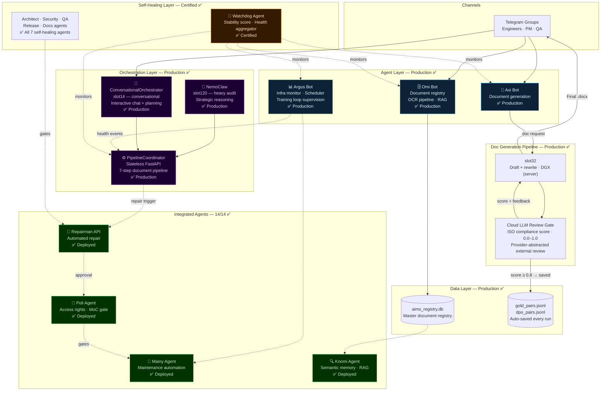
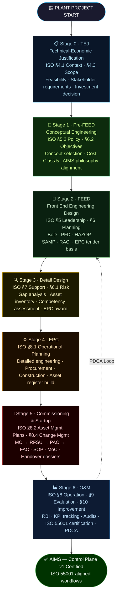
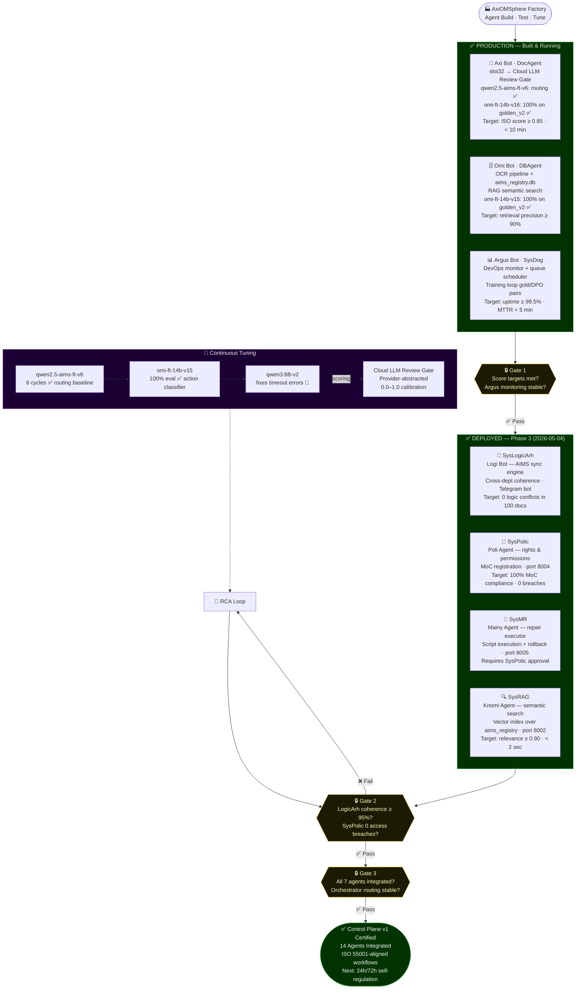
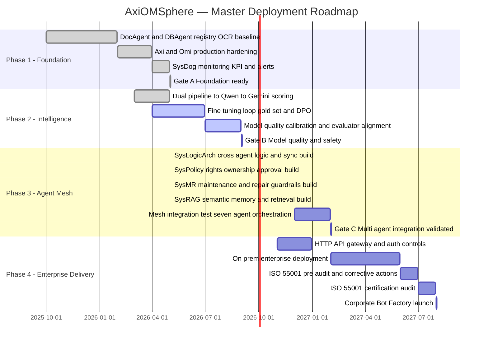
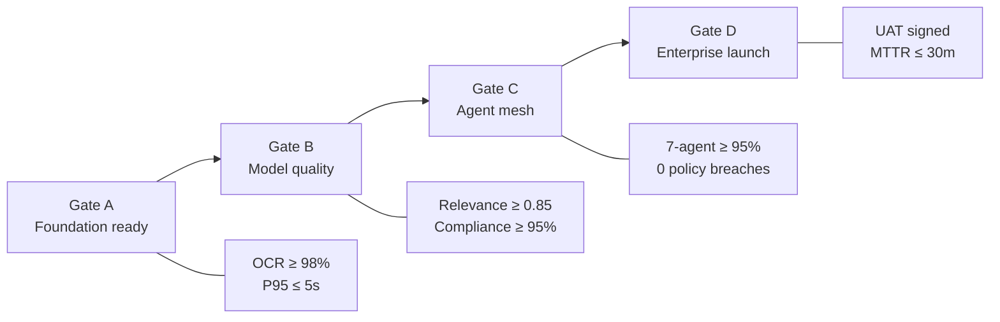
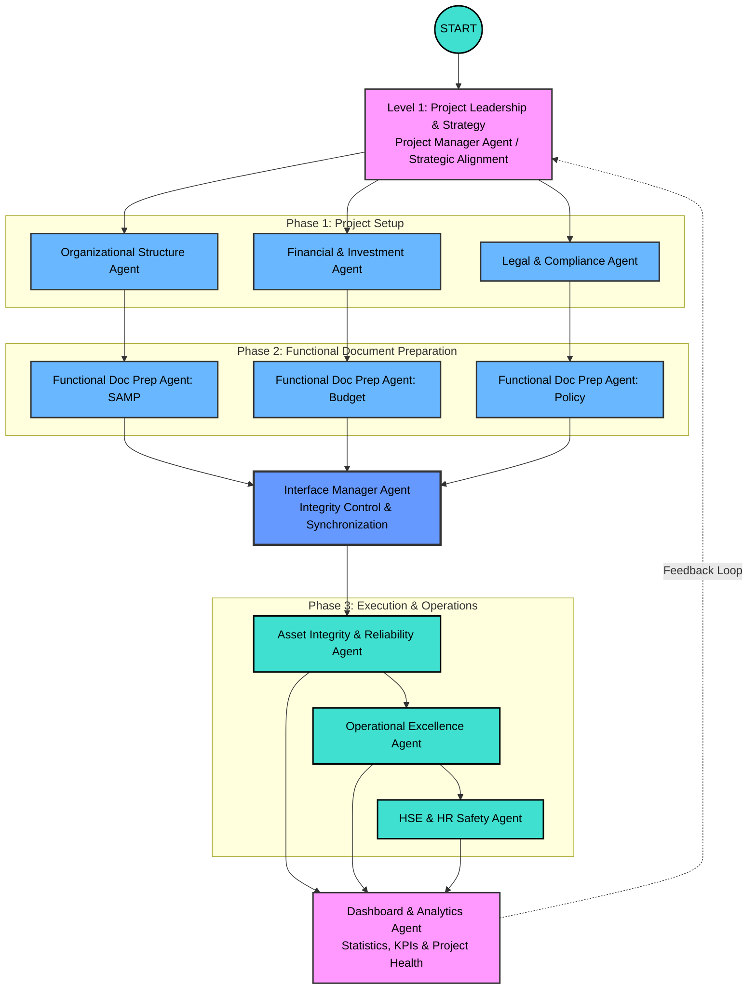
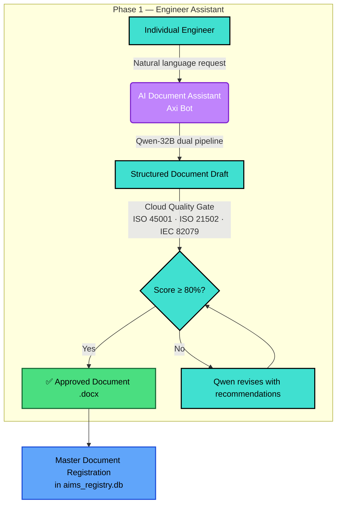
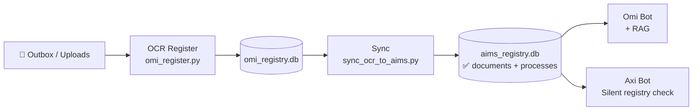
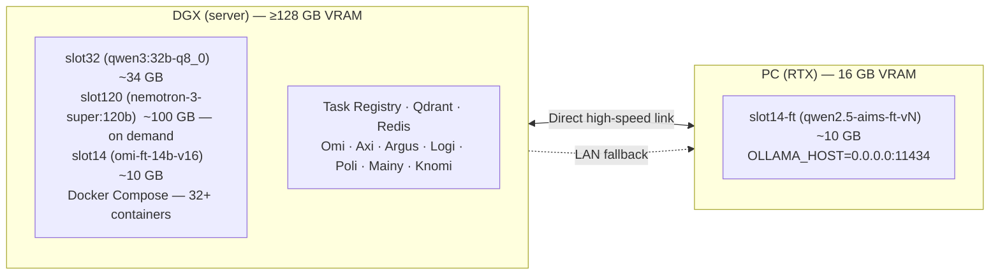

# AxiOMSphere
> **Multi-agent AI platform that automates industrial engineering workflows — from document generation to ISO compliance — using coordinated LLM agents running on private infrastructure.**

**Self-Tuning · Self-Healing · Self-Orchestrated · Self-Driven**

[🌐 Website](https://axiomsphereassistanceaims.github.io/AxiOMSphere/) · [📺 Demo](#demo) · [📬 Contact](#contact) · [📋 Apply for Credits](#grant-applications)

---

## What We Do

AxiOMSphere replaces manual project startup engineering work with coordinated AI agents. Each agent handles one function — document generation, quality control, registry management, infrastructure monitoring — and they operate as a continuous pipeline.

Four design principles define the system:
- **Self-Tuning** — every production run saves training pairs automatically; models improve with each use through a nightly fine-tuning loop
- **Self-Healing** — Argus monitors all services 24/7; detected failures trigger the Repairman loop (diagnose → approve → patch → verify) without manual intervention
- **Self-Orchestrated** — agents coordinate through PipelineCoordinator and a task ledger; the Autonomy Control Plane v1 is certified for unattended operation
- **Self-Driven** — free-text requests are classified locally and routed to the right agent; the system operates as a continuous, background engineering pipeline

**The result is 1,5 year for 1 month:**
-  A document describing a business process, typically written in 2-3 days each by several specialists from different disciplines (recruited for a specific project), can be created in less than 10 minutes within an integrated functional system within a single functional area, in accordance with the AIMS project philosophy (a total of 1.5 years of work in 1 month). Even by non-experts or department heads, it allows for task assignments via chat, voice, or text, from any location. The database is based on several projects, providing valuable experience.
- ISO compliance verified automatically, not by hand
- Every generation run feeds back into model training — the system improves with every use

We're currently working in production with live engineers and actively scaling usage. We expect significant demand for the API in the next 1-3 months as the team expands and new types of documentation, tests, and cross-validations are added.

---

## Current Verified Status — 2026-05-21

| Milestone | Result |
|-----------|--------|
| Autonomous Launch Test Suite | **10/10 PASS** |
| Autonomy Control Plane v1 | **CERTIFIED** |
| Consecutive autonomous task runs | **5/5 PASS** |
| Final project status | `READY_FOR_AUTONOMOUS_OPERATION_WITH_TASK_LEDGER_V1` |
| Telegram delivery after each control-plane run | confirmed |
| Fullstack integration audit | **PASS — 14/14 agents fully integrated** |
| DGX model concurrency policy | **PASS** |
| Stability audit | WARN: historical Redis evidence only — no active blockers |
| Inbox-cleanup lifecycle false blocker | closed |
| Repairman Slot32 training pipeline | **5/5 phases active** — 44/750 pairs accumulating |
| Slot120 replacement evaluation | **IN PROGRESS** — deepseek-r1:70b candidate (download) |
| Next certification stage | 24h/72h long-running self-regulation |

**Evidence docs:**
- [`docs/AUTONOMY_CONTROL_PLANE_V1_CERTIFICATION.md`](docs/AUTONOMY_CONTROL_PLANE_V1_CERTIFICATION.md)
- [`docs/AUTONOMY_NEXT_STAGE_LONG_RUNNING_SELF_REGULATION.md`](docs/AUTONOMY_NEXT_STAGE_LONG_RUNNING_SELF_REGULATION.md)
- [`docs/AIMS_FULLSTACK_INTEGRATION_STATUS.md`](docs/AIMS_FULLSTACK_INTEGRATION_STATUS.md)
- [`ops/autonomy_control/README.md`](ops/autonomy_control/README.md)

---

## Business Impact

| Before AxiOMSphere | With AxiOMSphere |
|-------------------|-----------------|
| 2–3 days to write a Oeration & Maintenance procedure | 5–10 minutes, reviewed and delivered to Telegram |
| 20 engineers / 2 DCC specialists / 5 department heads / 2 HR specialists to write 1000 procedures for 1.5 years | 5 engineers (hybrid work), 5-10 minutes, problem formulation 10 minutes, 1000 documents will be checked and sent to Telegram and saved in the database with full compliance with the company format and banding within 14 days |
| Any change in functionality in the vertical distribution chain will require a process of revising the upstream documents of 1000 procedures for 1.5 years | An integrated system capable of independently reviewing and comparing functionality and interface interactions is capable of restoring discrepancies in documents in a matter of hours, even without the process of revising them |
| ISO compliance checked manually, often skipped | Automated scoring 0.0–1.0, rewrite loop until ≥80% |
| Knowledge locked in PDFs on shared drives | Searchable, versioned, semantically indexed master documents registry |
| Model training requires a separate team | Every production run generates gold + DPO training pairs automatically |
| Infra issues noticed when users complain | Argus monitors 24/7, auto-restarts, alerts with one-click fix (every one has unic function) |

---

## Why We Need API Credits

AxiOMSphere is a **high-frequency, multi-agent system** where every user task decomposes into coordinated agent stages:

```
User request → Planning → Draft (slot32) → Rewrite (slot32) → Score (cloud review gate) → Revise → Register → Notify
```

Unlike a single-prompt application, **one document workflow requires 20–100+ LLM calls**:
- Complince agent: standart's identification by context (allocation for ISO55001/55002)
- Reasoning agent: structural outline + ISO clause mapping to standard ISO 9000:2015:
- Rewrite agent: professional formatting pass ISO 19005-1:2005
- Quality gate: compliance scoring + gap feedback
- Revision loop: targeted rewrites until score ≥ 80%
- Registry agent: classification, embedding, storage

**Expected usage as we scale:**
- Workflows run continuously (CI/CD-style, nightly pipeline)
- Multiple agents operate in parallel per task
- Every scaling step compounds token consumption

**What credits enable:**
1. Validate multi-agent orchestration at production scale
2. Optimize prompt strategies across model configurations
3. Benchmark admin 14B / coding 32B/ logical 32B/ fine formating 32B quality vs. the highest documents tuned cloud model tradeoffs
4. Create production-ready automated pipelines for broader enterprise document processing and localization in professional collection databases. 

Without sufficient API capacity it is not possible to realistically simulate or validate real-world agent workloads at the volume our architecture is designed for.

> We are not building a chatbot. We are building a system designed for sustained, large-scale LLM usage where API consumption is a core component of the product.

---

## Demo

**Scenario: Automated Safety Document Generation**

```
Input:  "developing a preservation procedure for an Aluminum plant, as requested. The procedure was being structured as a
        Word document (.docx) with initial sections covering Purpose, Scope, and Definitions, and was designed to incorporate
        the specified subcomponents: Power Plant, Power Distribution (HV/LV), Paste Plant, Anode Baking Plant, Bath Crushing
        Plants, Pot Lines, Fume Treatment Plant, Cast House, Port Facilities, and Utilities.
         Reference ISO 55001. The AIMS process database synchronization."

Stage 1 — Planning agent      (~30 sec)
  → Identifies: JSA template, applicable OSHA 29 CFR 1910.147 local corporate manuals and procedures based on equipment types
  → Outlines: scope, equipment types identification sections, control hierarchy

Stage 2 — Draft agent: slot32 runtime model (resolved via registry)   (~3 min)
  → Generates structured draft with ISO 10013 / ISO/IEC Directives-aware section headers
  → Produces hazard table with risk matrix, elimination → substitution → PPE controls

Stage 3 — Rewrite agent: slot32 runtime model (resolved via registry)     (~2 min)
  → Professional formatting, paragraph cohesion, terminology standardization ISO 2145:1978

Stage 4 — Cloud LLM Review Gate  (~15 sec)
  → Score: 0.84 / 1.0
  → Feedback: "Add specific corrections and specification per ....."

Stage 5 — Revision: slot32 runtime model (resolved via registry)          (~2 min)
  → Target correction applied, assessment re-checked (knowledge base and lessons learned in background)

Output: JSA_confined_space_entry.docx → delivered to Telegram
        ISO compliance: 84%   |   Total time: ~11 min
        Training pair saved → gold_pairs.jsonl (score ≥ 0.8)
```


[🖼 Architecture](docs/ARCHITECTURE.md)
[📺 <video src="docs/demo.mp4" controls width="100%"></video>]                            

https://github.com/user-attachments/assets/84069854-3288-4b8c-96f7-aa70d5362347

---

## Use Cases in Production Today

| Task | Document type | Standard | Time |
|------|--------------|----------|------|
| AIMS philosophies | Asset Management systems - Guidelines | ISO 55001/55002 | ~10 min |
| Procedures Equipment types, unites scope, standart requirement | Equipment isolation procedure + requirement matrix | OSHA 29 CFR 1910.147 local corporate manuals and procedures | ~12 min |
| Pump replacement — change control | Management of Change (MOC) | ISO 45001 §8.1.3 | ~8 min |
| New asset onboarding | Asset Management Plan | ISO 55001 §8.2 | ~15 min |
| Project kick-off package | Charter + WBS | ISO 21502 | ~20 min |
| Technical operating manual | User documentation | IEC 82079-1 | ~18 min |

---

## Minimal Code Example

```python
from doc_agent import DocAgent, DocGenerationRequest

agent = DocAgent()

result_path, preview, score, feedback = agent.generate(
    DocGenerationRequest(
        user_request="Create a Job Safety Analysis for confined space entry at an underground mine. "
                     "Reference ISO 45001. Include hazard table, controls hierarchy, permit conditions.",
        dual_pipeline=True,   # slot32 draft/rewrite → Cloud LLM Review Gate
    )
)

print(f"Document: {result_path}")
print(f"ISO compliance score: {score:.0%}")
print(f"Feedback: {feedback}")
# → Document: /data/JSA_confined_space_entry.docx
# → ISO compliance score: 84%
# → Feedback: "Document covers all required JSA sections with complete hazard controls matrix."
```

---

## 🟢 Live System — What Runs Today



---

## System Recovery

AxiOMSphere includes automatic recovery infrastructure that survives full system restarts:

**Watchdog Bot** (runs outside Docker stack):
- Automatic startup sequence after hardware reboot
- Dependency-aware service startup (4 tiers: infrastructure → core → agents → bots)
- Health validation with 5-minute timeout
- Telegram notifications on success/failure
- Manual commands: `/status`, `/rebuild_all`, `/up`, `/auto_startup`, `/restart <service>`, `/logs <service>`

**Recovery Flow:**
```
Hardware Reboot
  → Watchdog detects >30% services down
    → Tier 1: Redis, Qdrant (infrastructure)
      → Tier 2: Core services (task-registry, omi-api, litellm)
        → Tier 3: Agents (doc-agent, aims-api, aims-orchestrator)
          → Tier 4: Bots & Workers (axi-bot, omi-bot, argus-bot)
            → Health validation (30s intervals, 5 min timeout)
              → Telegram notification + ArgusAgent monitoring
```

**Self-Healing Loop:**
```
ArgusAgent detects failure
  → PipelineCoordinator.on_health_event()
    → RepairmanAPI.trigger()
      → PoliAgent approval (concept preservation check)
        → Claude Code execution (repair/fix)
          → ArgusAgent verification
```

---

## How It Works

### Doc Generation Pipeline

| Stage | Model | Role | Time |
|-------|-------|------|------|
| **Draft** | slot32 runtime model (registry-resolved) | ISO-aware reasoning, structural outline | ~3 min |
| **Rewrite** | slot32 runtime model (registry-resolved) | Professional formatting, terminology | ~2 min |
| **Score** | Cloud LLM Review Gate | Compliance 0.0–1.0, gap feedback | ~15 sec |
| **Revise** | slot32 runtime model (registry-resolved) | Targeted fix per score feedback | ~2 min |

Quality gate: <60% → reject + retry · ≥60% → accepted · target: **98% compliance** (internal pilot goal)

### NLP Intent Routing

All bots use a local fine-tuned model (`chat_intent_router.py`) to classify free-text messages into slash commands **before** any cloud LLM call — keeping latency low and cloud costs minimal:

```
"check if DGX is up"  →  /dgx status
"show stuck tasks"    →  /tasks --stuck
"generate MOC doc"    →  /doc --type=moc
```

Keyword fallback (`_keyword_classify`) activates automatically when the secondary-node routing model is offline — no cloud calls needed for common commands.

### Cross-Bot Handoff

Inter-agent message passing uses **Redis as primary transport** (`AIMS_REDIS_URL`), with SQLite as graceful fallback when Redis is unavailable:

```
enqueue_handoff() → Redis RPUSH handoff:{target}  [primary]
                 → SQLite cross_bot_handoff table  [fallback]
claim_pending_for_target() → Redis LPOP (atomic)  [primary]
                          → SQLite poll            [fallback]
```

In-flight tracking via `handoff:inflight:{id}` (1h TTL) enables automatic re-queue on failure without changing the public API.

### Continuous Training Loop

Every production run auto-saves training pairs — no opt-in flag needed:
- `gold_pairs.jsonl` — document + task pairs scoring ≥ 0.8
- `dpo_pairs.jsonl` — preference pairs for RLHF (DPO trainer, `ops/ft/scripts/dpo_train.py`)

These feed the nightly fine-tuning pipeline (14B → 32B), so the system improves as it operates.

---

## Agent Architecture — Core Runtime Roles + 14 Fullstack Integrated Agents

> Latest integration audit: **14/14 registered agents fully integrated** — 0 missing skill packs · 0 failed smokes · 0 active stale refs. See [`docs/AIMS_FULLSTACK_INTEGRATION_STATUS.md`](docs/AIMS_FULLSTACK_INTEGRATION_STATUS.md).


---

## Project Nomenclature

**AxiOMSphere** is a strategic integration of four pillars:

| Part | Meaning |
|------|---------|
| **Axiom** | Foundational precision of international standards |
| **AIMS** | Asset Integrity Management System — central intelligence |
| **O&M** | Operations & Maintenance — highest-value lifecycle phase |
| **Sphere** | Unified 360° ecosystem — Single Source of Truth |

---

## AIMS Process Framework

The agent factory is structured around the **GFMAM Asset Management Landscape** — 8 subject areas forming the complete ISO 55001-aligned process framework.


> *Global Forum on Maintenance and Asset Management (GFMAM) — aligned with ISO 55001:2024*

---

## ISO-Aligned Project Lifecycle

AxiOMSphere covers all 7 stages of an industrial plant project:



---

## Deployment Roadmap

### Agent Build, Test & Tuning Sequence



### Master Timeline



### Gate KPI Criteria

- **Gate A — Foundation ready:** OCR/sync ≥ 98% for 30 days · P95 retrieval ≤ 5s · SysDog alerting active
- **Gate B — Model quality:** Retrieval relevance ≥ 0.85 · Format compliance ≥ 95% · Hallucination ≤ 3% on critical docs
- **Gate C — Multi-agent integration:** 7-agent pass rate ≥ 95% · Zero SysPolicy violations · Cross-agent handoff P95 ≤ 15s
- **Gate D — Enterprise launch:** UAT signed · MTTR ≤ 30 min in pilot · Audit nonconformities closed



---

## Industrial Project Escalation



---

## Document Generation — Agent Structure



---

## Document & OCR Pipeline



---

## Data Pipeline (Full)


---

## Fine-Tuning Pipeline

```mermaid
flowchart TD
    DOCS["📄 Domain documents"] --> INGEST["00:01 ingest_new_docs"]
    INGEST --> PAIRS["00:30 generate_pairs\n72B on DGX (~60–90 min)"]
    PAIRS --> FT["02:30 ft_prepare_chain_run\n14B → 32B\n(2h buffer after pair gen)"]
    FT --> DEPLOY["05:30 deploy_14b\nblob-push to PC (RTX) Ollama"]
    DEPLOY --> BOT["✅ qwen2.5-aims-ft-vN:latest\nactive on PC (RTX)"]
    style PAIRS fill:#1a2f4a
    style FT fill:#1a2f4a
    style BOT fill:#1a4731
```



**Model versioning:** `vN` / `vNrM` — e.g. `v7`, `v7r1`, `v15`, `v15r1`

### Fine-Tuning Status (2026-05)

| Run | Model | Dataset | Eval | Notes |
|-----|-------|---------|------|-------|
| v16 | Qwen2.5-14B QLoRA | v10 (754 samples) | **50/50 — 100%** ✅ (golden_v2) | Omi action classifier — **deployed** |
| v17 | Qwen2.5-14B QLoRA | v11 | 36/57 — 63.2% ⚠️ (golden_v3) | Regression vs v16 — NOT deployed; failures: answer×7, handoff×5, clarify×4 |
| qwen3-14b-v17 | Qwen3-14B QLoRA | v11 | 31/57 — 54.4% ⚠️ (golden_v3) | Worse than v16 — NOT deployed |
| **repairman-slot32-v1** | Qwen3-32B QLoRA | repairman_slot32_v1 | **GATE BLOCKED** — 44/750 pairs | Training unlocks at 750 pairs; accumulating via continuous learning loop · night window 02:00–06:00 UTC |

golden_v3 expanded the suite to 57 cases. V17 nightly retrain scheduled; v16 remains production.

**Repairman QLoRA feasibility (slot120 replacement):** DeepSeek-R1-Distill-Llama-70B (`deepseek-r1:70b`) selected as primary slot120 evaluation candidate — R1 chain-of-thought reasoning distillation on Llama 3.3 70B base, MIT license, Ollama-native. Download in progress (Gate 2). Gates 3–4 (4-bit load + LoRA init, tiny training run) pending.

DPO pairs: `ops/ft/scripts/dpo_train.py` — TRL DPOTrainer, 4-bit QLoRA.

---

## GPU Cluster Topology



**Routing rules:** slot14 FT models → PC (RTX) · slot32 and slot120 never loaded simultaneously on DGX (server) · slot120 loads alone on demand · `OLLAMA_RESOLVE_TTL_SEC=30` prevents latency spikes

---

## Technical Reference

### Running Services (2026-05-21)

| # | Container | Status | Role |
|---|-----------|--------|------|
| 1 | `axiomsphere-aims-redis` | ✅ healthy | Redis queue backbone (`AIMS_REDIS_URL`) |
| 2 | `axiomsphere-qdrant` | ✅ running | Vector DB — standards RAG (port 6333) |
| 3 | `axiomsphere-prometheus` | ✅ running | Metrics collection |
| 4 | `axiomsphere-grafana` | ✅ running | Dashboards (port 3000) |
| 5 | `axiomsphere-task-registry` | ✅ running | Task state API (port 8765) |
| 6 | `axiomsphere-flaresolverr` | ✅ healthy | JS-render proxy for scrapers |
| 7 | `axiomsphere-schedule` | ✅ running | Cron: nightly FT, deploy, etc. |
| 8 | `axiomsphere-inbox-cleanup` | ✅ running | 14-day inbox purge |
| 9 | `axiomsphere-litellm` | ✅ running | Cloud AI review gate proxy (port 4400) |
| 10 | `axiomsphere-ocr-watcher` | ✅ running | OCR pipeline (`Dockerfile.ocr-eng`) |
| 11 | `axiomsphere-omi-api` | ✅ running | Omi REST API (port 8765) |
| 12 | `axiomsphere-omi-quality-gate` | ✅ running | Post-OCR quality filter |
| 13 | `axiomsphere-omi-batch-ingest` | ✅ running | Batch document processor |
| 14 | `axiomsphere-doc-agent` | ✅ running | Doc generation API (port 8767) |
| 15 | `axiomsphere-axi-bot` | ✅ running | Main Telegram bot (production) |
| 16 | `axiomsphere-argus-bot` | ✅ healthy | Infra monitor + scheduler |
| 17 | `axiomsphere-omi-bot` | ⚠️ running, not responding | Container up — LLM/queue bug TBD |
| 18 | `axiomsphere-aims-api` | ✅ running | Internal task API (port 8000, internal network) |
| 19 | `axiomsphere-aims-worker` | ✅ running | Redis worker pool (4 threads) |
| 20 | `axiomsphere-aims-orchestrator` | ✅ running | Failure analysis daemon (Redis `queue:orchestrator`) |
| 21 | watchdog-bot (host process) | ✅ running | Outside Docker — monitors all 20 containers |

Scheduled (run on demand via `schedule` container, `restart: 'no'`): `omi-register`, `omi-sync`, `job-filter-bot`.

### Model Table

| Slot | Model | Size | Node | Role |
|------|-------|------|------|------|
| **slot32** | `axi_omi_sphere` (qwen3:32b-q8_0) | ~34 GB | Primary (warm) | DocAgent — draft, rewrite, revision; Repairman FT base (slot32-v1 accumulating 44/750 pairs) |
| **slot32-code** | `qwen2.5-coder:32b` | 20 GB | Primary (warm) | Argus diagnostics / code / chat |
| **slot14** | `omi-ft-14b-v16` (Qwen2.5-14B QLoRA) | ~10 GB | Primary | Omi action classifier — **100% on 50/50 golden_v2 ✅ deployed** |
| **slot14-ft** | `qwen2.5-aims-ft-vN:latest` | ~10 GB | Secondary (PC RTX) | Intent routing — Omi, Axi, Argus |
| **slot120** | `nemotron-3-super:120b` | ~100 GB | Primary (on demand) | Repairman champion — retained baseline; load separately, never with slot32 |
| **slot120-eval** | `deepseek-r1:70b` (candidate) | ~43 GB Q4_K_M | Primary (eval only) | Slot120 replacement evaluation — DeepSeek-R1-Distill-Llama-70B; download in progress; not routed to production |

**VRAM rule:** slot120 and slot32 are never loaded simultaneously. Unload before switching. slot120-eval is for benchmarking only — do not promote to routing until benchmark gates pass.

### Night Schedule

| Time UTC | Task | Note |
|----------|------|------|
| 22:30 | VRAM unload (`pre_docbench_unload.py`) | Clears GPU before DocBench |
| 23:00 | DocBench nightly | Quality regression test |
| 00:01 | `training_ingest` | Ingest new documents |
| 00:30 | `training_generate_pairs` | 32B on DGX, ~60–90 min |
| **02:30** | `ft_prepare_chain_run` | Shifted from 01:20 — 2h GPU buffer |
| 05:30 | `daily_deploy_14b` | Push slot14-ft to PC (RTX) via Ollama blob |

### Deploy

```bash
# All services including Phase 3 agents
docker compose --profile telegram-bots up -d

# Restart core bots
docker compose restart argus-bot omi-bot axi-bot

# Start Anthropic proxy gateway (for Claude Code repairman)
bash ops/gateway/start_gateway.sh
```

---

## Claude Code Repairman

Claude Code runs as a project-wide repair agent through a local gateway proxy that routes to the on-premises slot120 model.

```bash
# Start gateway
bash ops/gateway/start_gateway.sh

# Connect Claude Code via gateway (credentials in .env)
claude --model aims-repairman-nemotron
```

Config: `ops/config/claude_code_repair_tool.yaml`. Forbidden operations: `exfiltrate_secrets`, `bypass_poli_in_production`, `delete_production_data`.

---

## Standards

| Standard | Coverage |
|----------|----------|
| **ISO 55001:2024** | Asset management — requirements (primary schema) |
| **ISO 55002:2018** | Asset management — implementation guidelines |
| **IEC/IEEE 82079-1:2019** | Technical documentation |
| **ISO 21502:2020** | Project management guidance |
| **ISO 10013:2021** | Guidelines for Documented Information |
| **ISO 2145** |  Numbering of Divisions and Subdivisions |
| **ISO 9000:2015** | Fundamentals & Vocabulary |
| **ISO 19005** | Document File Format for Long-Term Preservation |
| **ISO 15489** | Information and Documentation - Records Management |

more than international 150 standards, around 1500 master document

*ISO standards serve as credibility anchors and compliance scoring targets — not as the core product message.*

---

## Audit Change Log

### 2026-05-21 — Repairman Slot32 Activation + Slot120 Replacement Evaluation

| # | Change | Impact |
|---|--------|--------|
| 1 | Repairman Slot32 training pipeline activated — 5/5 phases complete (KNOMI, TRAINI, Hermes, Continuous Learning, Docs) | qwen3:32b is now the Repairman fine-tuning base; 44/750 training pairs accumulated |
| 2 | Repairman knowledge base seeded — KNOMI Phase 1 (15/15 PASS) extracted repair domain topics | Structured repair rules and patterns available to training pipeline |
| 3 | Traini dataset generator activated — 24/24 PASS; structured Q&A + repair scenario pairs generated | Automated pair generation from knowledge base operational |
| 4 | Hermes Review Bridge (Phase 3) active — advisory quality gate for training pairs | Human-in-the-loop review wired into accumulation loop |
| 5 | Continuous learning loop — 17/17 function modules PASS (env audit, log analysis, config diff, stack trace parse, root cause) | All repair pattern modules operational |
| 6 | Slot120 replacement evaluation initiated — llama3.1:70b cancelled (~7%); candidate upgraded to deepseek-r1:70b | DeepSeek-R1-Distill-Llama-70B: R1 chain-of-thought reasoning on Llama 3.3 70B base; MIT license; Ollama-native; ~43 GB Q4_K_M |
| 7 | Fullstack integration audit — terminology updated from "Gstack" to "Fullstack" across all project docs | Naming consistency across codebase and documentation |

### 2026-05-15 — AIMS Code Skills Curriculum v1

| # | Change | Impact |
|---|--------|--------|
| 1 | 13 `/code-*` skill commands defined — registry, audit, router, packet builder, test generator | Formal repair curriculum complete |
| 2 | Code skill audit — 13/13 PASS | All skills conform to policy: slot, safety, output_contract |
| 3 | Slot 32 skills (10): code_search, code_review, code_fix, code_test, code_debug, code_refactor, code_perf, code_model_slot, code_ft_pipeline, code_deploy | Engineering execution layer wired |
| 4 | Slot 120 skills (3): code_audit, code_scaffold, code_migrate | High-stakes reasoning layer wired |
| 5 | Global forbidden actions enforced — 14 actions no skill may authorise | Policy compliance verified |
| 6 | RepairmanAPI auto-repair loop: ArgusAgent → RepairmanAPI wired | Phase 4 self-repair complete |

### 2026-05-13 — Autonomy Control Plane v1 Certified

| # | Change | Impact |
|---|--------|--------|
| 1 | 10/10 Autonomous Launch test suite — full PASS | `READY_FOR_AUTONOMOUS_OPERATION` confirmed |
| 2 | Autonomy Control Plane v1 — 5/5 consecutive runs PASS | `ctrl_plane_v1_1778694743` certified |
| 3 | Fullstack integration audit — 14/14 agents fully integrated | 0 missing skill packs · 0 failed smokes |
| 4 | `omi-ft-14b-v16` trained — 50/50 (100%) on golden_v2 | Deployed; v17 63.2% regression held back |
| 5 | Self-healing layer — all 7 agents UP (ports 8010–8016) | Watchdog stability 1.00 |
| 6 | DGX model concurrency policy smoke — PASS | slot120 and slot32 mutual-exclusion verified |
| 7 | Knomi RAG seed knowledge and KNOMI_OLLAMA_URL wired | 3/3 RAG queries return ≥ 5 results |
| 8 | Cloud provider migration completed — 21 files updated | 0 active direct external provider calls remain |

### 2026-05-04 — Production Launch Sprint

| # | Change | Impact |
|---|--------|--------|
| 1 | `argus_orchestrator.py` IndentationError fixed | Argus bot stable |
| 2 | `Dockerfile.ocr-eng` created | `ocr-watcher` now builds and runs |
| 3 | `.env` `@aims_watchdog_bot` bare `@` replaced with comment | Docker Compose parses cleanly |
| 4 | `Dockerfile.aims-services` created — shared base for aims-api/worker/orchestrator/Phase 3 agents | All new services start correctly |
| 5 | `aims-api`, `aims-worker`, `aims-orchestrator` moved to correct Dockerfile + PYTHONPATH | No more crash loops |
| 6 | `ops/aims_orchestrator_daemon.py` created — Redis polling daemon | `aims-orchestrator` stays alive |
| 7 | Watchdog fixed — `docker ps --filter status=running` + healthcheck status | No more false "all UP" reports |
| 8 | `omi-bot` token chain collision in docker-compose fixed | Omi bot now processes messages |
| 9 | `logi-bot` added to docker-compose (`telegram-bots` profile) | Cross-dept sync deployed |
| 10 | `poli-agent` added to docker-compose (port 8004, healthcheck) | Access rights gate deployed |
| 11 | `mainy-repair-agent` added to docker-compose (port 8005, requires poli-agent) | Repair executor deployed |
| 12 | `knomi-agent` added to docker-compose (port 8002, healthcheck) | Semantic RAG search deployed |
| 13 | Keyword fallback `_keyword_classify` added to `chat_intent_router.py` | Intent routing works offline |
| 14 | `ops/ft/scripts/dpo_train.py` written — 22 pairs, TRL DPOTrainer, 4-bit QLoRA | DPO training ready |
| 15 | Redis transport added to `cross_bot_handoff.py` (SQLite fallback kept) | Cross-bot queue no longer fragile |
| 16 | `redis>=5.0.1` added to `Dockerfile.axi-bot` + `omi_telegram/requirements.txt` | Both bots can use Redis handoff |
| 17 | `AIMS_REDIS_URL` + `depends_on: aims-redis` added to axi-bot + omi-bot in compose | Redis wired end-to-end |
| 18 | `ops/core/sandbox_runner.py` created — high-level sandbox API over `executor.py` | Code execution ready for agents |
| 19 | Watchdog alert on `running+unhealthy` added to `argus_monitor._loop_containers` | No silent health failures |
| 20 | `omi-ft-14b-v15` trained — 14/14 (100%) on `golden_v2.json` | Omi action classifier production-ready |

### 2026-04-24 — Infrastructure Hardening

| # | Change | Impact |
|---|--------|--------|
| A | Removed `gpus` from `ocr-watcher` / `omi-register` (CPU-only) | Freed DGX VRAM for models |
| B | `pre_docbench_unload.py` + 22:30 step in night schedule | No VRAM collision before DocBench |
| C | `ollama_resolve.py` tries PC first, DGX as fallback | Eliminated 6s DGX-timeout latency |
| D–E | `weekly_model_upgrade.py` + `daily_deploy_14b` support `vNrM` versioning | Clean v7r1, v7r2, v8… deploys |
| F | PC: `OLLAMA_HOST=0.0.0.0:11434` (machine env) | Small model reachable from DGX |
| G | `chat_intent_router.py` — NLP free-text → slash command module | No more missed free-text commands |
| H | Intent router wired into all 3 bots (Argus 18, Omi 12, Axi 3 cmds) | All bots understand natural language |
| I | `OLLAMA_RESOLVE_TTL_SEC=30` | Resolve cache — no more 6s delays |
| J | `QWEN_PC_ASSIST_WARM_ON_TELEGRAM=0` | Stops redundant warm-up API calls |
| K | FT chain 01:20 → **02:30** | 2h GPU buffer after pair generation |
| L | Secondary node direct-link network profile (Windows Task Scheduler) | Ethernet profile survives reboot |

---

## Roadmap Visual


---

## Repository Layout

```
AxiOMSphere/
├── README.md
├── CLAUDE.md                    # Claude Code project guide
├── PLAN.md                      # Full project roadmap — phases 0–5, current status
├── PROJECT_CONSTITUTION.md      # Invariants — roles, RAG, security, language (append-only)
├── LICENSE                      (Apache-2.0)
├── docker-compose.yml           # All 21 services + Phase 3 agents
├── docker-compose.dgx.yml       # DGX-specific overrides
├── .env.spark.example           # Environment variable template
├── ops/
│   ├── axi_bot.py               # Telegram bot — document generation (~8772 lines as of 2026-05-19)
│   ├── aims_orchestrator_daemon.py  # Redis polling daemon for aims-orchestrator
│   ├── agents/                  # Agent classes: Omi, Argus, Doci, Poli, Mainy, Knomi…
│   ├── argus/                   # Infra monitoring: keepalive, diagnose, orchestrator
│   ├── gateway/                 # Anthropic-compatible proxy → Ollama/NIM (port 8082)
│   │   ├── anthropic_proxy.py   # FastAPI app
│   │   └── start_gateway.sh     # Sources .env BOM-safe, sets model env vars
│   ├── core/                    # Config validator, queue, worker, metrics
│   │   ├── orchestrator.py      # DAG runner — DAG, Step, DAGResult with per-step retry
│   │   └── sandbox_runner.py    # High-level sandbox API wrapping executor.py
│   ├── workers/                 # Pipeline, quality, data, ft_pipeline workers
│   ├── router/                  # local_router, nim_router, fallback_router
│   ├── telegram/                # logi_bot.py (cross-dept sync)
│   ├── ft/                      # Fine-tuning pipeline (QLoRA, GGUF, eval)
│   │   ├── configs/             # train_config_v15.json, qwen3-8b-v2…
│   │   ├── data/                # Datasets (v9, v10, v11…)
│   │   ├── eval/                # golden_v2.json — 14 eval cases (Omi)
│   │   ├── logs/                # Eval results, train logs
│   │   └── scripts/             # build_dataset, train_qlora, eval_actions, dpo_train
│   ├── docagent/                # Doc generation: standards, RAG, cloud scoring
│   ├── omi_telegram/            # OCR register + sync to registry
│   ├── sandbox/                 # executor.py — isolated subprocess code execution
│   ├── scripts/                 # Nightly ops: deploy, upgrade, pre-docbench
│   ├── tests/                   # 26 pytest test files
│   ├── config/                  # Runtime state configs
│   ├── Dockerfile.axi-bot       # Axi bot image (CUDA 12.3, Playwright, redis)
│   ├── Dockerfile.aims-services # Shared base for aims-api/worker/orchestrator/Phase 3
│   ├── Dockerfile.ocr-eng       # English OCR (tesseract-ocr-eng)
│   └── Dockerfile.ocr-rus       # Russian OCR (tesseract-ocr-rus)
├── core/                        # Shared: errors, metrics, queue, route_learn, model_router
└── data/
    └── aims_registry.db         # Master document registry (SQLite)
```

---

## Quick Start

### Prerequisites

- NVIDIA GPU (≥40 GB VRAM recommended for slot32; ≥128 GB for slot120)
- [Ollama](https://ollama.ai) installed and running
- Docker + Docker Compose
- Python 3.11+
- `NVIDIA_API_KEY` (optional — for NIM cloud scoring)

### 1. Clone & configure

```bash
git clone https://github.com/<your-org>/AxiOMSphere.git
cd AxiOMSphere
cp .env.spark.example .env
# Edit .env — fill in PC_OLLAMA_URL, NVIDIA_API_KEY, Telegram bot tokens
# Note: .env has a UTF-8 BOM — Docker Compose handles it; strip manually only if sourcing in bash
```

### 2. Pull models

```bash
ollama pull qwen3:32b-q8_0       # primary draft/rewrite model (~34 GB)
ollama pull qwen2.5-coder:32b    # Argus diagnostics
```

### 3. Start all services

```bash
docker compose --profile telegram-bots up -d
```

### 4. Verify

```bash
docker compose ps
curl -sf http://localhost:8767/health  # DocAgent API
curl -sf http://localhost:8002/health  # Knomi Agent
curl -sf http://localhost:8004/health  # Poli Agent
curl -sf http://localhost:8005/health  # Mainy Agent
```

### 5. Run tests

```bash
export PYTHONPATH=$(pwd):$PYTHONPATH
python -m pytest ops/tests/ -v -m "not integration"
```

---

## Verified vs Target

| Metric | Verified (2026-05-21) | Target |
|--------|-----------------------|--------|
| Autonomous launch test | 10/10 PASS | 10/10 |
| Autonomy Control Plane runs | 5/5 consecutive PASS | 5/5 |
| Agents integrated (Fullstack audit) | 14/14 | 14/14 |
| Omi classifier accuracy (golden_v2) | 100% (50/50) | ≥ 95% |
| Self-healing watchdog stability | 1.00 | ≥ 0.95 |
| ISO review gate score (target) | Internal pilot goal: 0.98 | ≥ 0.98 |
| Code Skills Curriculum v1 (13 skills) | 13/13 PASS audit | All PASS |
| Repairman Slot32 training pairs | 44/750 (accumulating) | ≥ 750 to unlock training |
| Slot120 replacement eval | deepseek-r1:70b — download in progress | Benchmark gates 3–4 pending |
| 24h/72h unattended self-regulation | Not yet started | Next stage |

---

## Current Hardening Backlog

| Priority | Item | Status |
|----------|------|--------|
| P1 | V17 fine-tune regression — fix 21 failures, retrain | Nightly run scheduled |
| P1 | 24h/72h unattended self-regulation run | Next certification stage |
| P1 | Repairman Slot32 training gate — accumulate 750 pairs via continuous learning loop | 44/750 — night window 02:00–06:00 UTC active |
| P2 | Slot120 replacement eval — deepseek-r1:70b Gates 3–4 (4-bit load + LoRA init, tiny training run) | Gate 2 (HF download ~140 GB) in progress |
| P2 | `axi_ft_log/` root-ownership — gold pairs write path | Workaround active |
| P2 | ArgusAgent → Watchdog stability score wiring verification | WARN — historical evidence only |
| P3 | Knomi seed knowledge auto-ingest policy | Manual for now |
| P3 | Qwen3-coder:30b benchmark (slot32 code candidate) | Earliest 2026-05-22 |
| P3 | Docs-agent anonymization module (GAP-2) and language normalization (GAP-5) | Zero progress — next sprint |
| P4 | Formal ISO 55001 pre-audit | Phase 4 |

---

## Grant Applications

We are seeking cloud credits and startup program support:

| Program | Status | What we need |
|---------|--------|--------------|
| [Google for Startups Cloud](https://cloud.google.com/startup) | Applying | GPU compute for inference |
| [Microsoft Founders Hub](https://foundershub.startups.microsoft.com/) | Applying | Azure credits |
| [OpenAI Startup Program](https://openai.com/startups) | Applying | API credits |
| [NVIDIA Inception](https://www.nvidia.com/en-us/startups/) | Applying | DGX access / support |

---

## Contact

**Evgeny Shokk** — Founder, AIMS Platform

- 📧 Evgeny.shock@gmail.com
- 🌐 [Website](https://axiomsphereassistanceaims.github.io/AxiOMSphere/)
- 💼 [LinkedIn](https://www.linkedin.com/in/evgeny-shokk-54781716)

---

## License

[Apache License 2.0](LICENSE)

> Built on open-source: Python · Ollama · Qwen3 · Qwen2.5 · python-telegram-bot · python-docx · Redis · Qdrant · Prometheus · Grafana · external cloud review gate
