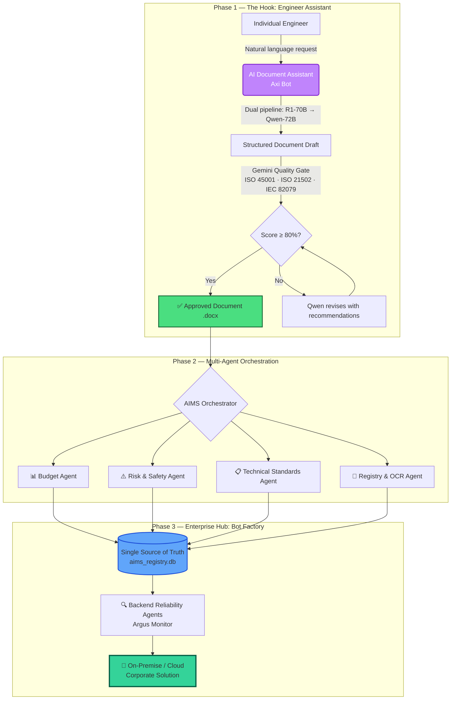
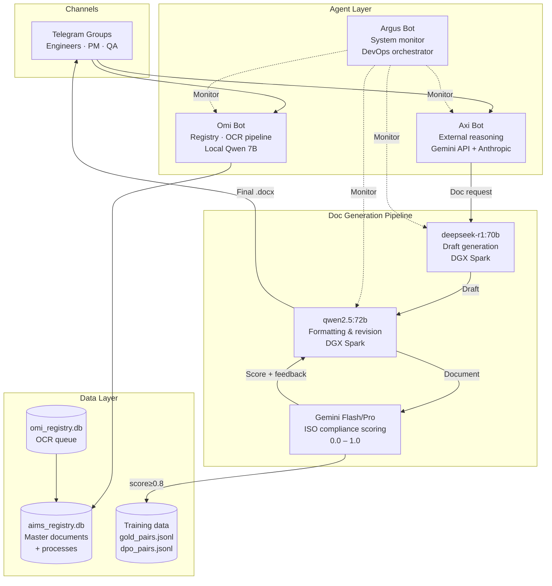
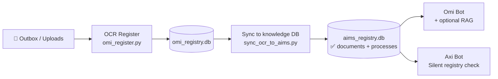
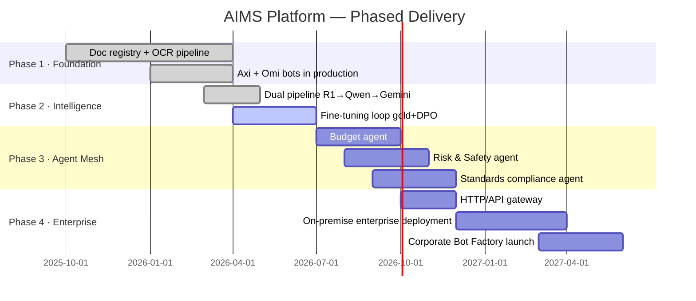

# AIMS Multi-Agent Platform
### Industrial Project Lifecycle Automation · ISO-Aligned · On-Premise Ready

[](LICENSE)
[](https://python.org)
[](#standards)
[](#doc-generation-pipeline)

> **Turning raw engineering requests into ISO-compliant documents in under 10 minutes — fully automated, fully auditable.**

[🌐 Website](https://axiomsphereaassistanceaims.github.io/AIMS-Agent-Orchestrator/) · [📺 Demo Video](#demo) · [📬 Contact](#contact) · [📋 Apply for Credits](#grant-applications)

---

## One-liner

A **multi-agent orchestration platform** for Asset Integrity Management (AIMS) in energy and heavy industry: document registry, ISO-aligned documentation control, AI-driven planning, and a **single source of truth** across all project disciplines.

---

## The Problem

Industrial projects — mining, oil & gas, energy, manufacturing — generate **hundreds of controlled documents** that must comply with international standards. Today these are:

- Scattered across tools, emails, and spreadsheets
- Manually checked against ISO/IEC/API standards
- Slow to produce (days, not minutes)
- Hard to audit and trace

A compliance gap in a JSA, an ERP, or an MOC procedure costs lives and halts production.

---

## Our Solution: From Hook to Factory



---

## Live System Architecture

Our production system runs **today** with real engineers:



---

## Doc Generation Pipeline

The core AI loop — **R1 → Qwen → Gemini** — runs today on DGX Spark hardware:

| Stage | Model | Role | Avg. Time |
|-------|-------|------|-----------|
| **Draft** | deepseek-r1:70b | Structural reasoning, ISO-aware outline | ~5 min |
| **Format** | qwen2.5:72b | Professional formatting, section rewrite | ~3 min |
| **Score** | Gemini Flash/Pro | ISO compliance 0.0–1.0, gap feedback | ~15 sec |
| **Revise** | qwen2.5:72b | Targeted revision using Gemini feedback | ~2 min |

Output: production `.docx` with ≥80% ISO compliance score. If score < 0.6, pipeline retries automatically.

**Training loop baked in:** every run produces `gold_pairs.jsonl` (score ≥ 0.8) and `standard_dpo_pairs.jsonl` for continuous model fine-tuning.

---

## Standards We Align With

Our agents are natively grounded in:

| Standard | Scope |
|----------|-------|
| **ISO 21502:2020** | Project management guidance |
| **ISO 21500:2021** | Project, programme and portfolio management concepts |
| **IEC/IEEE 82079-1:2019** | Preparation of information for use — technical documentation |
| **ISO 9001 §7.5** | Control of documented information |
| **ISO 45001** | Occupational health and safety management |
| **API RP 505** | Fire protection for refineries |

---

## Document & OCR Pipeline



---

## Minimal Code Example

```python
from doc_agent import DocAgent, DocGenerationRequest

agent = DocAgent()

result_path, preview, score, feedback = agent.generate(
    DocGenerationRequest(
        user_request="Create a Job Safety Analysis for confined space entry at an underground mine. "
                     "Reference ISO 45001. Include hazard table, controls hierarchy, permit conditions.",
        dual_pipeline=True,   # R1-70B → Qwen-72B → Gemini quality gate
    )
)

print(f"Document: {result_path}")
print(f"ISO compliance score: {score:.0%}")
print(f"Feedback: {feedback}")
# → Document: /data/JSA_confined_space_entry.docx
# → ISO compliance score: 84%
# → Feedback: Document covers all required JSA sections with complete hazard controls matrix.
```

---

## Use Cases

| Use Case | Document Type | Standard |
|----------|---------------|----------|
| Confined space entry | Job Safety Analysis (JSA) | ISO 45001 |
| H2S release at gas plant | Emergency Response Procedure | API RP 505 |
| Fan replacement in mine | Management of Change (MOC) | ISO 45001 §8.1.3 |
| Project kick-off | Project charter + WBS | ISO 21502 |
| Technical manual | User documentation | IEC 82079-1 |

---

## Roadmap



---

## Repository Layout

```
AIMS-Agent-Orchestrator/
├── README.md                   ← this file
├── LICENSE                     (Apache-2.0)
├── docs/
│   ├── ARCHITECTURE.md         system design details
│   ├── DEMO_SCENARIO.md        step-by-step demo guide
│   └── STANDARDS_MAPPING.md   ISO/IEC clause → agent capability
├── examples/
│   └── doc_agent_example.py   minimal usage example
└── docker-compose.yml          evaluation setup (optional)
```

---

## Grant Applications

We are seeking cloud credits / startup program support from:

| Program | Status | What we need |
|---------|--------|--------------|
| [Google for Startups Cloud Program](https://cloud.google.com/startup) | Applying | GPU compute for inference |
| [Microsoft Founders Hub](https://foundershub.startups.microsoft.com/) | Applying | Azure credits |
| [OpenAI Startup Program](https://openai.com/startups) | Applying | API credits |
| [NVIDIA Inception](https://www.nvidia.com/en-us/startups/) | Applying | DGX access / support |

**Application email template:** see [`docs/EMAILS_STARTUP_CREDITS.md`](docs/EMAILS_STARTUP_CREDITS.md)

---

## Demo

**Coming soon:** 60-second screen recording — engineer types a natural-language request → DocAgent dual pipeline → ISO-compliant `.docx` delivered to Telegram in under 10 minutes.

[📺 Watch Demo](#) · [🖼 Architecture Diagram](docs/ARCHITECTURE.md) · [🌐 Landing Page](https://axiomsphereaassistanceaims.github.io/AIMS-Agent-Orchestrator/)

---

## Contact

**Evgeny Shokk** — Founder, AIMS Platform

- 📧 nasty.monk779@gmail.com
- 🌐 [Website](https://axiomsphereaassistanceaims.github.io/AIMS-Agent-Orchestrator/)
- 💼 [LinkedIn](https://www.linkedin.com/in/evgeny-shokk-54781716)

---

## License

[Apache License 2.0](LICENSE)

> Built on open-source: Python · Ollama · deepseek-r1 · Qwen2.5 · Google Gemini · python-telegram-bot · python-docx
