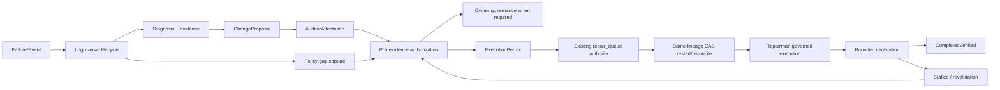

# 61 — System Dependency Graph

## Canonical graph

The queue is the sole execution-lineage authority. `GovernedExecutionStore` is the existing governance-event authority. The policy contract module owns hash-bound envelope validation; it does not own queue state or execute repairs. Logi captures and correlates evidence but cannot activate policy or mutate the queue. Repairman executes only after the permit boundary.

## Boundary rules

| Source | Target | Authority/state | Contract and identity | Failure/retry/recovery | Runtime/tests | Classification |
|---|---|---|---|---|---|---|
| failure event | Logi causal lifecycle | Logi causal store | failure/correlation root | durable intake; replay dedupe | Logi poller; Logi tests | canonical |
| diagnosis | ChangeProposal | Repair case ledger | repair_case_id + source hash | incomplete evidence routes to evidence-required | contract tests | canonical |
| proposal | AuditorAttestation | Auditor decision authority | proposal_hash + candidate/evidence hashes | stale proposal requires re-audit | integration tests | canonical |
| attestation + policy | ExecutionPermit | Poli authorization | policy revision/hash + exact scope | stale policy/evidence rejected | contract tests | canonical |
| Owner callback | GovernedExecutionStore | Owner approval event ledger | approval id/hash + nonce/correlation | replay mismatch rejected | store integration tests | canonical |
| permit | repair queue | existing queue file | repair_id + lineage + idempotency key | lock/CAS/atomic replace; crash-safe file replacement | queue concurrency test | canonical |
| queue | Repairman | Repairman execution boundary | permit hash/nonce and queue lineage | missing/legacy route fail closed | repairman tests | canonical |
| verification | completion | queue lineage | repair_id + verification evidence | failed verification remains non-terminal | state model tests | canonical |
| stalled case | revalidation | policy contracts | old proposal/policy/source hashes | changed inputs require fresh permit | integration tests | canonical |
| stalled case | policy-gap capture | Logi capture boundary | case + correlation + policy revision fingerprint | second pass suppresses false positives | classifier tests | permanent |
| canary target | assurance harness | disposable namespace only | certification marker, no production authority | cleanup/repeat run required | NAR-009 harness | permanent assurance |
| legacy ALLOW/DENY | current policy | no execution authority | compatibility projection only | re-audit/migration; cannot execute | projection tests | transitional/read-only |
| legacy Repairman backend | governed backend | no authority | retired; explicit error | fail closed, operator rework | retirement test | retired |
