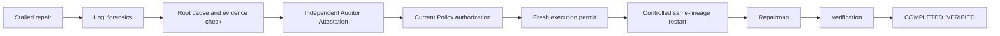

# Evidence-governed repair

 AIMS treats repair as a governed, evidence-bound lifecycle. A stalled repair is not resumed because a broad rule says it is safe: the exact proposed solution is reviewed, tested and risk-assessed before the current policy authorises a fresh permit.

The Auditor attestation is bound to the exact proposal, source/candidate hashes, evidence, tests and rollback. If any of those change, the previous approval is stale and cannot authorize execution. Logi investigates stalled work and can capture an evidence-backed policy gap, but it does not change policy. Policy changes require Auditor evidence and Owner design, application and activation approvals.

Policy evolution is a separate branch:

```mermaid
flowchart LR
  A[Genuine policy gap] --> B[Logi capture]
  B --> C[Policy change proposal]
  C --> D[Auditor review]
  D --> E[Owner design approval]
  E --> F[Candidate shadow]
  F --> G[Owner application]
  G --> H[Installed not active]
  H --> I[Owner activation]
  I --> J[Active policy]
```

Policy activation is not automatic backlog restart. Historical and stalled repairs require fresh revalidation and a new permit before a controlled restart.

The controlled restart capability was certified with a clearly marked, disposable non-production fault-injection canary. It used the existing queue and repair path, preserved one lineage, reconciled a duplicate restart idempotently, restored the target and reached `COMPLETED_VERIFIED`. This certifies the mechanism without requiring a production incident or changing production policy.

Current boundary: the first genuine policy false-negative will start the separately governed policy-change lifecycle. No artificial policy gap is created to trigger it.
